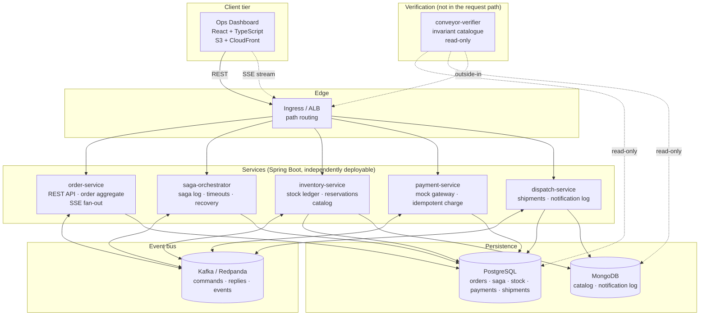
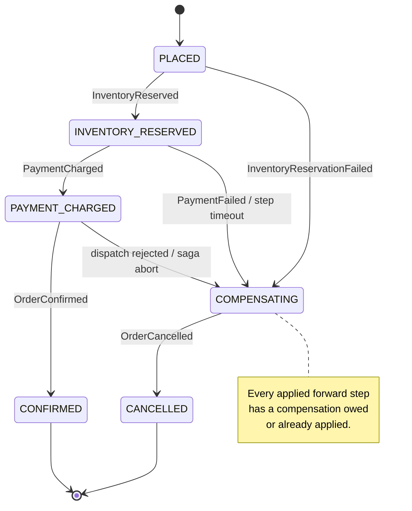
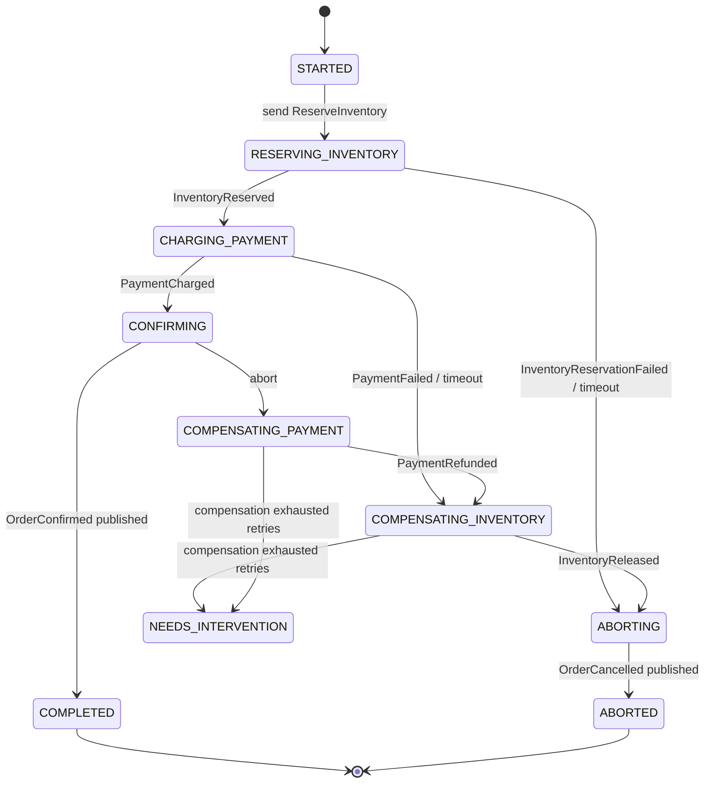
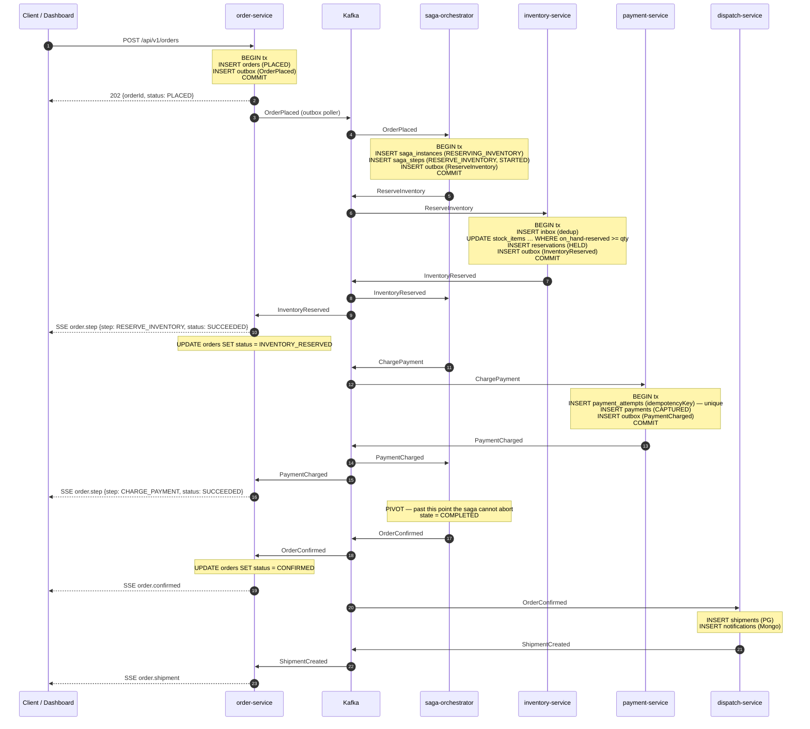
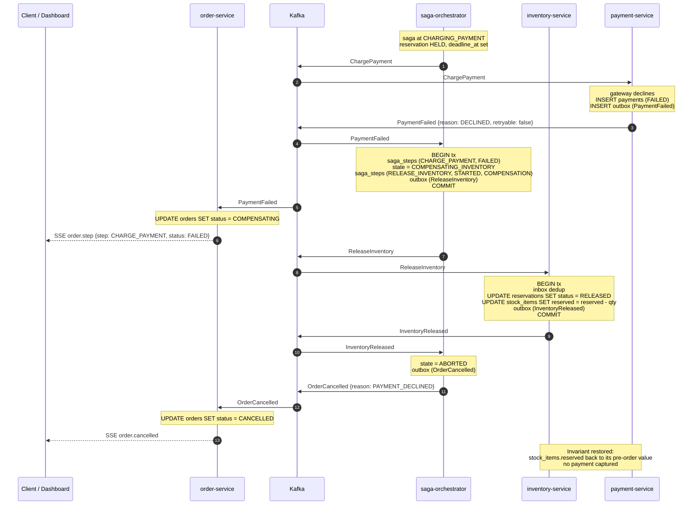
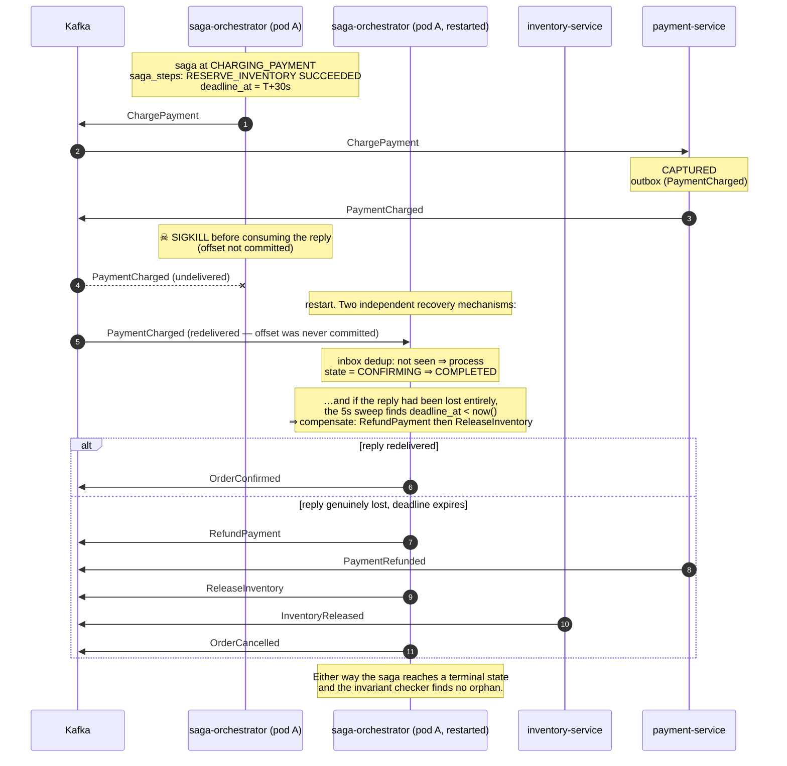

# ARCHITECTURE.md — Conveyor

**Version:** 1.0 (Phase 0) · **Date:** 2026-09-09 · **Status:** awaiting sign-off

This is the design document. `PROJECT_BRIEF.md` says *what*; this says *how and
why*. Every decision that could reasonably have gone another way is written up
ADR-style in §3 with the alternative and the reason it lost.

---

## Table of contents

1. [The thesis, restated as an engineering claim](#1-the-thesis-restated-as-an-engineering-claim)
2. [System overview](#2-system-overview)
3. [Decisions (ADRs)](#3-decisions-adrs)
4. [Service boundaries and data ownership](#4-service-boundaries-and-data-ownership)
5. [Data model](#5-data-model)
6. [Event schemas, envelope and topic conventions](#6-event-schemas-envelope-and-topic-conventions)
7. [The Saga](#7-the-saga)
8. [Sequence diagrams](#8-sequence-diagrams)
9. [Delivery guarantees: outbox, inbox, idempotency](#9-delivery-guarantees-outbox-inbox-idempotency)
10. [API contracts](#10-api-contracts)
11. [Observability](#11-observability)
12. [Security](#12-security)
13. [The invariant catalogue](#13-the-invariant-catalogue)
14. [Fault injection design](#14-fault-injection-design)
15. [Deployment topology and cost](#15-deployment-topology-and-cost)
16. [Non-goals](#16-non-goals)

---

## 1. The thesis, restated as an engineering claim

Anvil implements two-phase commit inside one database. 2PC gets atomicity by
holding locks across a *prepare* phase: participants promise they can commit and
then wait, unable to release, until the coordinator decides. That is affordable
inside a storage engine where participants are processes you own, latencies are
sub-millisecond, and a blocked participant is a local problem.

It is not affordable across services. A Payment Service cannot hold a
"prepared" charge open while an Inventory Service decides, because the two are
owned by different teams, scale independently, and a coordinator crash would
wedge one of them indefinitely. So the service layer trades atomicity for a
weaker property:

> **Saga guarantee.** The system reaches one of two terminal outcomes for every
> order: *all* forward steps applied, or *every applied forward step
> compensated*. Intermediate states are observable to other readers — there is
> no isolation — but no terminal state leaves the system inconsistent.

Concretely, the differences Conveyor must actually demonstrate, not just assert:

| Property | 2PC (Anvil) | Saga (Conveyor) |
|---|---|---|
| Atomicity | Real. Nobody observes a partial commit. | **No.** Inventory is visibly reserved before payment is charged. |
| Isolation | Serializable / SSI | **None between steps.** Handled with semantic locks (reservations) instead. |
| Coordinator crash | Participants block until recovery | Participants never block; the saga log drives recovery |
| Rollback | Physical — undo the write | **Semantic** — a compensating business action (`release`, `refund`) that is itself a new forward transaction |
| Failure atomicity proof | Elle checker over client histories + internal invariants | Invariant checker over service databases + chaos trial matrix |

The rigor phases exist to make the bottom row true rather than claimed. Anvil's
lesson, carried over: **an outside-in checker cannot see a bug that never
reaches a client.** Conveyor's invariant checker therefore reads the service
databases directly (§13), not only the REST APIs — an orphaned inventory
reservation for a cancelled order is invisible from `GET /orders/{id}` and is
exactly the class of bug this project must be able to find.

---

## 2. System overview



**Five services, not four.** The kickoff specified four; the Saga-style decision
(ADR-1) adds `saga-orchestrator` as a fifth. This is flagged explicitly for
sign-off. `conveyor-verifier` is a sixth deployable but is a *test instrument*,
not part of the product — it is never in a request path and can be switched off
without affecting behaviour.

---

## 3. Decisions (ADRs)

Each decision below states the choice, the alternatives, and what would change
our mind. These graduate to `docs/adr/NNNN-*.md` in Phase 1; they live here at
Phase 0 so there is one document to review.

### ADR-1 · Saga style: **orchestration, in a dedicated `saga-orchestrator` service** ⭐ *[OPEN-1 — needs sign-off]*

**Decision.** Orchestration. A dedicated `saga-orchestrator` service owns a
durable saga log and drives the transaction by sending *commands* to
participants and consuming their *replies*.

**Why orchestration over choreography.**

1. **It is the honest analogue of 2PC, which is the entire point of the
   project.** A coordinator with a durable transaction record is precisely what
   Anvil has. The interesting comparison — "the coordinator exists in both, but
   here it cannot block participants, and its log records *semantic* rather than
   *physical* undo" — is only available if there is a coordinator to point at.
   With choreography there is no coordinator and the comparison collapses into
   "well, the events happen in an order."
2. **Saga state must be a first-class, queryable object for the rigor phases to
   be possible.** The chaos experiment measures a *compensation correctness
   rate*. That requires knowing, for each trial, which forward steps had been
   applied at the moment of the kill and which compensations were owed. Under
   choreography that state is smeared across four databases and has to be
   reconstructed by inference. Under orchestration it is one row plus an
   append-only step log — the direct analogue of Anvil's transaction record.
3. **The per-order timeline the dashboard needs is the saga step log.** It
   exists for free instead of being assembled from four services' events.
4. **Timeouts have somewhere to live.** "Inventory never replied" is only
   detectable by something that knows a reply was expected. Choreography has no
   such component, so a lost message wedges an order silently forever — which is
   the most common real failure and one this project should be able to survive.

**Why choreography loses.** Its real advantages are lower coupling (participants
know nothing about the flow) and no single point of coordination. Both are worth
something. But at four participants and one saga type, the coupling cost is
small, and the "single point of coordination" objection is answered by making
the orchestrator stateless-between-messages with all state in Postgres — killing
it loses nothing, which the chaos phase must demonstrate. Choreography's
distributed-state opacity is a real cost with no offsetting benefit at this
scale.

**Why a dedicated service over logic embedded in Order Service.**

- The flagship chaos experiment is *"kill the coordinator mid-saga."* If the
  coordinator lives inside Order Service, that kill also takes down the REST API
  and the SSE stream, so the experiment measures two things at once and the
  dashboard goes dark exactly when you want to watch it recover.
- Order Service is request-driven (bursty, latency-sensitive); the orchestrator
  is message-driven (throughput-sensitive). They want different autoscaling
  behaviour, and the autoscaling phase is better with a service whose load can
  be driven independently of the HTTP tier.
- Separation of concerns: the orchestrator is a generic step-and-compensate
  engine; the order flow is one saga definition fed to it.

**Cost of the dedicated service, stated plainly.** Two state machines now exist
that must agree: the saga instance's state and the order aggregate's status.
This is a genuine source of bugs and is mitigated structurally:

> **Single-writer rule.** `saga_instances` / `saga_steps` are written *only* by
> the orchestrator. `orders.status` is written *only* by Order Service, which
> derives it from saga events it consumes. The order status is a **projection**
> of saga progress and is eventually consistent with it, lagging by one message
> hop. INV-SAGA-05 (§13) checks convergence with a grace window; the dashboard
> shows the saga log as authoritative for "where is this order right now."

**What would change our mind.** If the project grew to several saga types with
different participants, or if the orchestrator became a throughput bottleneck
that could not be sharded by `orderId`, choreography's decoupling would start to
pay for its opacity.

---

### ADR-2 · Local Kafka: **Redpanda locally, real Apache Kafka in CI and production** ⭐ *[OPEN-2 — needs sign-off]*

**Decision.** `docker-compose` and the default Testcontainers profile use
**Redpanda**. A dedicated CI job runs the full integration suite against
**Apache Kafka (KRaft)** via `KafkaContainer`. Production runs real Kafka.

**Reasoning.** The dev loop matters: six services plus Postgres plus Mongo plus
a broker on a laptop is already heavy, and Redpanda boots in ~1s against
~10–15s for Kafka, in a single process with no JVM and roughly a third of the
memory. Multiplied across every Testcontainers-based integration test in the
suite, that is the difference between a test run you re-run freely and one you
avoid.

**The risk and its mitigation.** Redpanda is wire-compatible but not
bit-identical — most plausibly around transactions, consumer-group rebalance
timing, and log-compaction semantics. Adopting it *silently* would mean shipping
a system verified against a broker it does not run on. So the compatibility is
**tested, not assumed**: a `kafka-compat` CI job runs the same integration suite
against Apache Kafka, and it is a required check. Any divergence is a `BUGS.md`
entry, not a shrug.

**Rejected.** *Kafka everywhere* — correct but slow enough to erode test
discipline. *Embedded/mock broker* — fastest, but a mock broker cannot exhibit
rebalance, partition-assignment or offset-commit behaviour, which is where
consumer bugs actually live.

---

### ADR-3 · MongoDB in production: **Atlas M0 (free tier)** ⭐ *[OPEN-3 — needs sign-off]*

**Decision.** MongoDB Atlas, M0 shared tier, for the deployed demo.
`docker-compose` uses the official `mongo` image locally.

| Option | Cost | Verdict |
|---|---|---|
| **Atlas M0** | **$0, indefinitely** (512 MB, shared) | ✅ Real MongoDB, managed, zero ops |
| Atlas M10 | ~$57/mo | Needed only if VPC peering / private endpoint is required |
| AWS DocumentDB | ~$0.078/hr ≈ **$57/mo minimum**, no free tier | ❌ Cost, and it *emulates* a MongoDB API version rather than being MongoDB — a partial-compatibility surface with no learning payoff here |
| Self-hosted on EKS | "free" (uses nodes already paid for) | ❌ A StatefulSet with PVs, backups and upgrades to operate, for zero project-relevant learning |

**Consequence to design around.** M0 has no VPC peering — connectivity is over
the public endpoint with TLS + SCRAM and an IP access list. EKS nodes therefore
need a stable egress IP (single NAT, or an allowlist of the node subnet's public
IPs). Connection limit is 500, so pods must use a bounded connection pool
(`maxPoolSize` set explicitly, not defaulted). Both are documented in the
deployment phase; neither affects local dev.

---

### ADR-4 · Build tool: **Maven, multi-module reactor** ⭐ *[OPEN-4 — needs sign-off]*

**Decision.** Maven. One parent POM, modules: `conveyor-contracts`,
`conveyor-common`, and one per service.

**Reasoning.** Spring Boot's documentation, `start.spring.io` defaults and
essentially every reference implementation are Maven-first, so friction and
copy-paste-error risk are lower. A declarative POM is faster for a *reviewer* to
read than a Kotlin build script — this is a portfolio artifact and legibility is
a feature. `mvn -pl service-x -am verify` gives clean per-module CI builds, and
Actions' Maven caching is one line.

**The honest counter-argument.** Gradle is genuinely faster (incremental builds,
configuration cache, build cache) and is what a lot of modern Java shops use.
At five small services the build is not the bottleneck, so the speed advantage
does not pay for the extra thing a reviewer has to parse. If the module count
tripled, this would flip.

**Fixed alongside it:** Java **21 LTS**, Spring Boot **3.5.x** (exact patch
pinned in Phase 1 against what is current then, and recorded in `CONTEXT.md`).

---

### ADR-5 · Admin auth: **self-issued RS256 JWT + Spring Security resource server** ⭐ *[OPEN-5 — needs sign-off]*

**Decision.** Order Service exposes `POST /api/v1/auth/login` against a small
`users` table (BCrypt). It issues a 15-minute RS256 access token and sets a
30-day refresh token in an `HttpOnly; Secure; SameSite=Strict` cookie. Every
service is a Spring Security **resource server** validating that token against a
JWKS endpoint. Roles: `ROLE_OPS` (read dashboards, read inventory) and
`ROLE_ADMIN` (adjust stock, retry a stuck saga).

- Public: `POST /api/v1/orders` (the customer path), `GET /actuator/health`.
- Authenticated: everything else, including the SSE stream.

**Rejected.** *Cognito / Auth0* — an external dependency and (for Cognito) AWS
config to stand up for a demo, and it hides the part that is actually worth
showing: token validation, method-level security, key handling. *Server-side
sessions* — a SPA on CloudFront talking to an ALB on a different origin makes
cookie sessions awkward, and they do not travel to the other four services.

**One real consequence, called out because it shapes the frontend.** The browser
`EventSource` API **cannot set an `Authorization` header.** The three ways out
are a query-string token (leaks into logs — rejected), a cookie (reintroduces
CORS/credential complexity), or **consuming the SSE stream with `fetch` +
`ReadableStream` and parsing the event framing manually.** We take the third: it
allows a normal `Authorization: Bearer` header, gives explicit control over
reconnect and `Last-Event-ID`, and is a direct reuse of the streaming-parser
work in EdgeRAG. This is a deliberate choice, not an accident.

---

### ADR-6 · Event schema: **versioned JSON with JSON Schema + a CI compatibility gate**; Avro is a stretch goal ⭐ *[OPEN-6 — needs sign-off]*

**Decision.** Plain JSON with an explicit envelope (§6.1) and a
`schemaVersion` integer. Schemas are JSON Schema files in `conveyor-contracts`,
the single module every service depends on. Two enforcement mechanisms make this
more than a naming convention:

1. **Contract tests.** Every producer test asserts its emitted event validates
   against the published schema; every consumer test runs against fixtures
   generated from that same schema. A producer cannot drift from its consumers
   without a red build.
2. **A compatibility gate.** A CI check diffs each schema against the version on
   `main` and fails the build on a backward-incompatible change (removing a
   field, narrowing a type, adding a required field) unless `schemaVersion` is
   bumped and a migration note is written.

**Why not Avro + Schema Registry now.** Schema Registry's value is exactly the
compatibility gate above, enforced at runtime by a service. With eight event
types in one repo, CI enforces the same property with no broker-side component
to run, secure and deploy — and a compile-time failure beats a runtime
`SerializationException`. Avro would additionally buy compact binary encoding,
which matters at a throughput this project will not reach.

**Stretch, explicitly scheduled not hand-waved.** Phase 16 carries an optional
task to add Apicurio Schema Registry and move one topic to Avro, keeping JSON on
the others, so the migration path is demonstrated rather than described. It is
cut first if time runs short, and cutting it is recorded, not silent.

---

### ADR-7 · Transactional outbox for every state-change-plus-publish *(not an open question — stated because it is load-bearing)*

No service ever writes its database and publishes to Kafka as two independent
operations. Each service has an `outbox` table written **in the same local
transaction** as the business change; a poller publishes rows and marks them
sent. This is the direct service-layer echo of Anvil's durability findings
(`ack` before `fsync`, a non-atomic size change under crash): the failure mode —
"the database committed but the event was never published, so the saga wedges" —
is the same bug wearing different clothes, and the fix has the same shape.

At-least-once delivery is therefore the contract, and every consumer is
idempotent via an inbox table (§9). CDC (Debezium) is the alternative; rejected
as a large operational component for a property polling achieves at this scale,
at the cost of a bounded publish latency (poll interval, ~200 ms).

### ADR-8 · Postgres migrations: **Flyway**, one migration folder per service

Plain SQL, versioned, per-service schema, no shared tables across services.
Rejected Liquibase: XML/YAML changelogs add an abstraction over SQL that buys
database portability we do not need.

### ADR-9 · Inventory concurrency: **guarded conditional UPDATE**, not `SELECT ... FOR UPDATE`

Reservation is a single statement:
`UPDATE stock_items SET reserved = reserved + :qty, version = version + 1 WHERE sku = :sku AND on_hand - reserved >= :qty`.
Zero rows affected ⇒ insufficient stock. This makes oversell structurally
impossible at the database level rather than by application check-then-act, and
holds no lock across a round trip. Phase 4's exit criteria include a concurrency
test: *N* concurrent reservations against one unit of stock, exactly one
succeeds.

### ADR-10 · Real-time transport: **SSE**, with per-replica broadcast consumer groups

Server→client only, so SSE over WebSocket: it is plain HTTP (traverses ALB and
CloudFront without upgrade handling), has built-in reconnect with
`Last-Event-ID`, and is the direct EdgeRAG callback.

The non-obvious part: with *n* replicas of Order Service behind a load balancer,
a browser connected to replica A must still see an event consumed by replica B.
Rather than adding Redis pub/sub, **each replica joins a unique, ephemeral
consumer group** (`sse-fanout-${POD_NAME}`, `auto.offset.reset=latest`) so every
replica receives every event on the dashboard topics and fans out to its own
connected clients. Cost: *n*× read amplification on those topics (negligible —
they are small), and abandoned consumer groups that Kafka expires via
`offsets.retention.minutes`. Documented as an accepted tradeoff.

### ADR-11 · Frontend stack

React 19 + TypeScript (`strict`, `noUncheckedIndexedAccess`) + Vite. **Tailwind
CSS + shadcn/ui** (Radix primitives — unstyled, accessible, vendored into the
repo rather than a versioned dependency, so the design is ours to change).
**TanStack Query** for REST caching, a hand-written `useSagaStream` hook for
SSE. **Vitest + React Testing Library** for critical flows, **Playwright** for
one end-to-end order-placement journey.

### ADR-13 · Deployment target: **zero-cost, forever** — no real AWS EKS/RDS is ever provisioned *(added 2026-09-10, at the human's explicit instruction: no spend, cut scope before spending)*

**Decision.** The terminal, always-on deployment target is **local/ephemeral
Kubernetes (kind/k3d)**, not AWS EKS. Specifically:

| Concern | Zero-cost choice | What it replaces |
|---|---|---|
| Kubernetes cluster | kind/k3d, run locally and spun up fresh inside the GitHub Actions runner for CI smoke tests | AWS EKS |
| Container registry | **GHCR** (GitHub Container Registry — free, unlimited for public images) | AWS ECR |
| Frontend hosting | **Vercel / Cloudflare Pages / GitHub Pages** (free indefinitely, no 12-month expiry to track) | S3 + CloudFront |
| Relational DB | Containerized Postgres (same image used in local dev) | AWS RDS |
| Kafka | Strimzi on kind (unchanged from §15.1) | AWS MSK — already rejected on cost |
| Document DB | Containerized `mongo` image, same as local dev — **not** Atlas M0. *(Reconciled Phase 16: this row's plan was Atlas M0, kept because it's already free — but the executed deployment path, Phase 14's kind-in-CI target, is itself local/ephemeral, so it never had occasion to reach for a persistent managed Mongo instance. `docs/adr/0003`'s own reconciliation note has the full detail.)* | — |
| IaC (Terraform for VPC/EKS/RDS/ECR) | **Written and validated** (`terraform validate`, `terraform plan` in CI against a sandbox) but **never `apply`'d** | A real, billed AWS deployment |

**Reasoning.** The human's instruction was explicit and unambiguous: stick to
free tier or cut scope, spend nothing. The previous plan (§15, Phases 14–15)
was already cost-*aware* — time-boxed sessions, a teardown script, an
explicit dollar figure before creating anything — but "time-boxed to ~$2" is
not "$0," and $0 was the actual instruction. Rather than negotiate that down,
the deployment target moves to infrastructure that is either genuinely free
forever (Atlas M0, GHCR, Vercel/Pages, GitHub Actions) or runs entirely on
hardware already owned (kind/k3d on the local machine or the free CI runner).

**What this costs the project, named honestly — there is exactly one gap.**
**Node-level cluster autoscaling** (Karpenter / Cluster Autoscaler
provisioning new EC2 instances under sustained load) is a claim about
*physical capacity acquisition* and cannot be demonstrated without a real
cloud account provisioning real machines — kind/k3d is bounded by whatever
compute the host already has. This is recorded as a named, tested-and-absent
capability in `docs/LIMITATIONS.md` (Phase 16), not hidden and not faked with
a script that pretends to add nodes.

**What this does *not* cost — everything Phase 15 is actually built to show.**
Pod-level `HorizontalPodAutoscaler` behavior — scaling `saga-orchestrator` on
`conveyor_saga_active` and `order-service` on CPU, the scale-up latency
decomposition (scrape delay → HPA decision → scheduled → Ready → serving), and
scaling efficiency at *n* replicas — is identical on a local multi-node k3d
cluster to what it would be on EKS. The HPA control loop does not know or care
whether the nodes underneath it came from `kind create cluster` or from AWS.
Nothing else in the plan (the Saga/2PC thesis, all five services, the
dashboard, or Stage D's rigor phases) touches AWS at any point and none of it
is affected by this decision.

**A secondary, and arguably better, portfolio line falls out of this.**
"Designed for AWS EKS, with Terraform written and `plan`-validated in CI,
deliberately never applied to keep the project's cost footprint at exactly
zero" is a more interesting thing to defend under questioning than "I stood up
EKS for an afternoon" — it is the same cost-discipline claim
`ARCHITECTURE.md` Appendix A already makes about the teardown script, taken to
its logical conclusion.

**What would change our mind.** If the human later wants a persistent public
cloud demo and is willing to spend the ~$2 for a time-boxed EKS session (the
original §15.3 budget), Phases 14–15 as originally written are the fallback —
nothing about Stages A–D would need to change to support it, since they were
never AWS-dependent. A middle option also exists and is *not* adopted by
default: Oracle Cloud's Always-Free tier (4 ARM cores / 24 GB RAM, genuinely
free forever, no time box) could host a real always-on k3s cluster with a
public IP. It is left as an optional future stretch rather than the default
path, because it adds a second cloud provider's tooling (OCI CLI, ARM image
compatibility) for a claim — "a real persistent cloud URL" — that
kind-in-CI plus a free static host already covers for demo purposes.

---

### ADR-12 · Product catalog is owned by Inventory Service

Catalog metadata (name, description, images, free-form attributes) is in Mongo;
stock levels are in Postgres; **both belong to Inventory Service.** This puts the
polyglot-persistence justification *inside one service*, where it is strongest:
the same bounded context stores "what a SKU is" as a document because its shape
varies per product category and is read whole, and "how many there are" in a
relational ledger because it needs `on_hand - reserved >= 0` enforced
transactionally. That is a sharper demonstration than assigning each database to
a different service, where the split could be arbitrary.

---

## 4. Service boundaries and data ownership

**Rule:** a table or collection has exactly one owning service. No service reads
another's storage. (The one exception is `conveyor-verifier`, which is a test
instrument and connects with a read-only role — §13.)

| Service | Owns (Postgres) | Owns (Mongo) | Publishes | Consumes |
|---|---|---|---|---|
| **order-service** | `orders`, `order_items`, `users`, `outbox`, `inbox` | — | `OrderPlaced` | `InventoryReserved`, `PaymentCharged`, `OrderConfirmed`, `OrderCancelled`, `*Failed` (to project status + fan out over SSE) |
| **saga-orchestrator** | `saga_instances`, `saga_steps`, `outbox`, `inbox` | — | `ReserveInventory`, `ReleaseInventory`, `ChargePayment`, `RefundPayment`, `OrderConfirmed`, `OrderCancelled` | `OrderPlaced`, all replies |
| **inventory-service** | `stock_items`, `reservations`, `stock_adjustments`, `outbox`, `inbox` | `catalog` | `InventoryReserved`, `InventoryReservationFailed`, `InventoryReleased` | `ReserveInventory`, `ReleaseInventory` |
| **payment-service** | `payments`, `payment_attempts`, `outbox`, `inbox` | — | `PaymentCharged`, `PaymentFailed`, `PaymentRefunded` | `ChargePayment`, `RefundPayment` |
| **dispatch-service** | `shipments`, `inbox` | `notifications` | `ShipmentCreated` | `OrderConfirmed` |

**Database-per-service in practice.** Locally, one Postgres *instance* with a
separate database and role per service — cheap, and the isolation that matters
(no cross-service joins, no shared migrations) is preserved. On AWS, one RDS
instance with the same per-service databases, for cost. This is a deliberate
deviation from strict database-per-service; it is recorded here so it cannot be
mistaken for an oversight, and the boundary it actually enforces (schema
ownership, independent migration history) is the one that matters for the claim
being made.

---

## 5. Data model

### 5.1 order-service (PostgreSQL)

```sql
orders (
  id              uuid primary key,
  customer_id     uuid            not null,
  status          text            not null,   -- see state machine §7.1
  saga_id         uuid,                       -- null until the saga starts
  total_amount    numeric(12,2)   not null,
  currency        char(3)         not null,
  shipping_address jsonb          not null,
  idempotency_key text unique,                -- client-supplied, dedups POST /orders
  version         bigint          not null,   -- optimistic lock
  created_at      timestamptz     not null,
  updated_at      timestamptz     not null
)
order_items (
  id uuid pk, order_id uuid fk, sku text, quantity int check (quantity > 0),
  unit_price numeric(12,2), unique (order_id, sku)
)
users (id uuid pk, username text unique, password_hash text, roles text[])
```

### 5.2 saga-orchestrator (PostgreSQL) — *the coordinator's transaction record*

```sql
saga_instances (
  id             uuid primary key,
  order_id       uuid not null unique,
  definition     text not null,             -- 'ORDER_FULFILLMENT'
  state          text not null,             -- §7.2
  current_step   text,
  compensating   boolean not null default false,
  failure_reason text,
  deadline_at    timestamptz,               -- when the current step times out
  attempt        int not null default 0,
  created_at     timestamptz not null,
  updated_at     timestamptz not null
)
saga_steps (                                -- append-only; this is the timeline
  id           bigserial primary key,
  saga_id      uuid not null,
  seq          int  not null,
  step         text not null,               -- RESERVE_INVENTORY | CHARGE_PAYMENT | ...
  direction    text not null,               -- FORWARD | COMPENSATION
  status       text not null,               -- STARTED | SUCCEEDED | FAILED | TIMED_OUT
  correlation_id uuid,
  detail       jsonb,
  occurred_at  timestamptz not null,
  unique (saga_id, seq)
)
```

`saga_steps` is append-only and never updated: a step that starts and then
succeeds writes two rows. That is what makes it a *log* rather than a status
column, and it is what the chaos analysis reads to reconstruct exactly where
each trial was killed.

### 5.3 inventory-service (PostgreSQL + MongoDB)

```sql
stock_items (
  sku          text primary key,
  on_hand      int  not null check (on_hand >= 0),
  reserved     int  not null check (reserved >= 0),
  reorder_level int not null default 10,
  version      bigint not null,
  updated_at   timestamptz not null,
  check (on_hand - reserved >= 0)            -- oversell is a constraint violation
)
reservations (
  id uuid pk, order_id uuid not null, sku text not null, quantity int not null,
  status text not null,                      -- HELD | RELEASED | COMMITTED
  created_at timestamptz, released_at timestamptz,
  unique (order_id, sku)                     -- idempotent reservation
)
stock_adjustments (id uuid pk, sku text, delta int, reason text, actor text, created_at timestamptz)
```

The `check (on_hand - reserved >= 0)` table constraint is deliberate: it means
an oversell bug surfaces as a failed transaction at the moment it is attempted,
not as silently corrupted stock discovered later. Belt and braces alongside
ADR-9's guarded update.

**MongoDB `catalog`** — one document per SKU, with a `$jsonSchema` validator on
the fields the system depends on (`sku`, `name`, `active`) and free-form
`attributes` beneath:

```json
{ "_id": "SKU-1042", "name": "…", "description": "…", "category": "…",
  "active": true, "images": ["…"], "attributes": { "…": "…" },
  "updatedAt": "2026-09-09T…" }
```

### 5.4 payment-service (PostgreSQL)

```sql
payments (
  id uuid pk, order_id uuid not null unique,   -- one payment per order
  amount numeric(12,2), currency char(3),
  status text not null,                        -- AUTHORIZED | CAPTURED | FAILED | REFUNDED
  gateway_reference text, created_at, updated_at
)
payment_attempts (                             -- idempotency evidence
  id uuid pk, order_id uuid, idempotency_key text unique,
  outcome text, gateway_reference text, created_at timestamptz
)
```

Charging is keyed on `idempotency_key = sagaId:CHARGE_PAYMENT`. A replayed
command finds the existing attempt and re-emits the original reply — it does not
charge twice. Phase 5's exit criteria test exactly this.

### 5.5 dispatch-service (PostgreSQL + MongoDB)

```sql
shipments (id uuid pk, order_id uuid unique, carrier text, tracking_number text,
           status text, created_at timestamptz)
```

**MongoDB `notifications`** — append-only log:
`{ orderId, channel: "EMAIL"|"SMS", template, recipient, renderedBody, status, sentAt }`.
Document-shaped because the payload differs per channel and template, is written
once and read whole, and never joined. A relational schema here would be a table
of nullable columns.

### 5.6 Shared infrastructure tables (in every service's own database)

```sql
outbox (id uuid pk, aggregate_type text, aggregate_id text, event_type text,
        topic text, message_key text, payload jsonb, headers jsonb,
        created_at timestamptz, published_at timestamptz null, attempts int)
inbox (message_id uuid, consumer text, processed_at timestamptz,
       primary key (message_id, consumer))
```

---

## 6. Event schemas, envelope and topic conventions

### 6.1 Envelope

Every message on every topic has the same envelope. Consumers can route and
deduplicate without knowing the payload type.

```json
{
  "eventId":       "1f0c…",           // UUIDv7. Unique per message. The dedup key.
  "eventType":     "InventoryReserved",
  "schemaVersion": 1,
  "occurredAt":    "2026-09-09T10:15:03.421Z",
  "producer":      "inventory-service",
  "sagaId":        "9b2e…",
  "orderId":       "44a1…",           // also the Kafka message key
  "correlationId": "9b2e…",           // = sagaId for all saga traffic
  "causationId":   "0d77…",           // eventId of the message that caused this one
  "payload":       { }
}
```

Kafka headers carry `traceparent` (W3C trace context — §11), `event-type`,
`schema-version`, `content-type: application/json`.

**`eventId` is UUIDv7** (time-ordered) so the inbox table's primary-key index
stays append-friendly rather than randomly distributed.

### 6.2 Topics

Convention: `conveyor.<context>.<kind>.v<major>`, `kind ∈ {commands, replies, events}`.
**Message key is always `orderId`** ⇒ every message for one order lands on one
partition ⇒ per-order ordering is guaranteed without any global ordering cost.

| Topic | Partitions | Retention | Produced by | Consumed by |
|---|---|---|---|---|
| `conveyor.order.events.v1` | 6 | 7 d | order-service, saga-orchestrator | saga-orchestrator, dispatch, order-service (SSE) |
| `conveyor.inventory.commands.v1` | 6 | 7 d | saga-orchestrator | inventory-service |
| `conveyor.payment.commands.v1` | 6 | 7 d | saga-orchestrator | payment-service |
| `conveyor.saga.replies.v1` | 6 | 7 d | inventory, payment | saga-orchestrator, order-service (SSE) |
| `conveyor.dispatch.events.v1` | 6 | 7 d | dispatch-service | order-service (SSE) |
| `<topic>.dlq` | 1 | 30 d | each consumer's error handler | humans, and the ops dashboard |

Six partitions everywhere so consumer-group scaling up to six instances is
demonstrable (relevant to the autoscaling phase). Replication factor 1 locally,
3 in production.

### 6.3 Event catalogue

**Facts (past tense, on `*.events` / `*.replies`)**

| Event | Producer | Payload |
|---|---|---|
| `OrderPlaced` | order | `{ customerId, items:[{sku,quantity,unitPrice}], totalAmount, currency, shippingAddress }` |
| `InventoryReserved` | inventory | `{ reservationIds:[uuid], items:[{sku,quantity}] }` |
| `InventoryReservationFailed` | inventory | `{ reason:"INSUFFICIENT_STOCK"\|"UNKNOWN_SKU", shortfalls:[{sku,requested,available}] }` |
| `InventoryReleased` | inventory | `{ reservationIds:[uuid] }` |
| `PaymentCharged` | payment | `{ paymentId, amount, currency, gatewayReference }` |
| `PaymentFailed` | payment | `{ reason:"DECLINED"\|"GATEWAY_ERROR"\|"TIMEOUT", retryable:boolean }` |
| `PaymentRefunded` | payment | `{ paymentId, amount, gatewayReference }` |
| `OrderConfirmed` | saga | `{ orderId, confirmedAt }` |
| `OrderCancelled` | saga | `{ orderId, reason, compensatedSteps:[…] }` |
| `ShipmentCreated` | dispatch | `{ shipmentId, carrier, trackingNumber }` |

**Commands (imperative, on `*.commands`)**

| Command | Payload |
|---|---|
| `ReserveInventory` | `{ items:[{sku,quantity}] }` |
| `ReleaseInventory` | `{ reservationIds:[uuid] }` |
| `ChargePayment` | `{ amount, currency, paymentMethodToken, idempotencyKey }` |
| `RefundPayment` | `{ paymentId, amount, idempotencyKey }` |

The distinction is enforced, not cosmetic: a **command** is addressed to exactly
one service, may be rejected, and carries an idempotency key. An **event** is a
fact, is addressed to nobody, and cannot be rejected. Mixing them is how
choreographed systems become impossible to reason about, and keeping them apart
is half of why ADR-1 went the way it did.

---

## 7. The Saga

### 7.1 Order state machine (order-service — the customer-facing projection)



### 7.2 Saga instance state machine (saga-orchestrator — authoritative)



**Terminal states are `COMPLETED`, `ABORTED`, `NEEDS_INTERVENTION`.**

`NEEDS_INTERVENTION` is deliberate and is not a cop-out. A saga's forward steps
may fail, but its **compensations must not be allowed to fail silently** — if
`RefundPayment` has been retried to exhaustion, the honest system behaviour is
to stop, alert, and surface it on the dashboard for a human, not to mark the
saga aborted and lose the money. INV-SAGA-04 counts these; a chaos trial that
lands here is a *failed* trial, and the chaos report will say so.

### 7.3 Step semantics

| Step | Forward | Compensation | Compensation is… |
|---|---|---|---|
| 1 | `ReserveInventory` | `ReleaseInventory` | idempotent, retried with backoff, **must eventually succeed** |
| 2 | `ChargePayment` | `RefundPayment` | idempotent, retried with backoff, **must eventually succeed** |
| 3 | Publish `OrderConfirmed` | — | pivot: once published, the saga cannot abort |

`OrderConfirmed` is the **pivot transaction**. Everything before it is
compensatable; nothing after it is. Dispatch is therefore a *retriable* step
(retry forever until it succeeds), not a compensatable one — which is the
correct saga classification and is why Dispatch consumes an event rather than
receiving a command with a reply.

### 7.4 Timeouts and recovery

- Each step sets `deadline_at = now() + stepTimeout` (default **30 s** forward,
  **60 s** compensation) when its command is sent.
- A scheduled sweep (every **5 s**) claims expired sagas with
  `SELECT … FOR UPDATE SKIP LOCKED` — so multiple orchestrator replicas can
  sweep concurrently without double-driving a saga — and applies the timeout
  policy: forward step timed out ⇒ begin compensation; compensation timed out ⇒
  resend the compensating command with exponential backoff, up to *N* attempts,
  then `NEEDS_INTERVENTION`.
- **Recovery on restart is the same code path.** A crashed orchestrator leaves
  sagas in non-terminal states with deadlines in the past; on restart the sweep
  picks them up. There is no separate recovery routine to get wrong — which is
  the design property the chaos phase is built to falsify.

---

## 8. Sequence diagrams

### 8.1 Happy path



### 8.2 Compensation path — payment declined after inventory reserved



**No refund is issued here**, because no charge was captured — the compensation
set is exactly the set of *applied* forward steps. The orchestrator derives it
from `saga_steps`, not from a hardcoded list. That distinction is what the
chaos matrix probes: kill the orchestrator *after* `PaymentCharged` is written
to the log but *before* the confirm is published, and the correct behaviour on
restart is a refund **and** a release.

### 8.3 Chaos scenario — orchestrator killed mid-saga



The two branches are both correct outcomes, and the chaos harness scores them as
such: the property being measured is **"every applied forward step is either
completed or compensated,"** not "the order was confirmed." A trial that
correctly cancels an order is a pass. This is stated up front because the
alternative — scoring only confirmations — would make the headline number
meaningless.

---

## 9. Delivery guarantees: outbox, inbox, idempotency

**Producer side (outbox).** Business write and outbox insert share one local
transaction. A poller (`FOR UPDATE SKIP LOCKED`, batch 100, every 200 ms)
publishes and stamps `published_at`. If the process dies after publishing but
before stamping, the row is republished — hence **at-least-once**.

**Consumer side (inbox).** Every consumer, in the same transaction as its
business write, inserts `(eventId, consumerName)` into `inbox`. A primary-key
violation means "already processed" ⇒ acknowledge and skip. Combined with
business-level idempotency (`reservations` unique on `(order_id, sku)`,
`payment_attempts` unique on `idempotency_key`) this gives **exactly-once
effects over at-least-once delivery** — which is the only honest form of
exactly-once, and worth saying that way.

**Ordering.** Guaranteed per `orderId` because that is the partition key.
Across orders there is no ordering and none is needed.

**Poison messages.** A consumer retries with exponential backoff
(`DefaultErrorHandler`, 3 attempts) and then publishes to `<topic>.dlq` with the
failure reason in a header. The orchestrator treats a DLQ'd command as a step
failure via its timeout, so a poison message degrades to a compensation rather
than a wedge. DLQ depth is a dashboard panel and an alert.

**Inbox growth.** A nightly job deletes `inbox` rows older than the topic
retention (7 d). Deleting sooner would reintroduce the duplicate window.

---

## 10. API contracts

Base path `/api/v1`. Errors are **RFC 9457 Problem Details**
(`application/problem+json`), with `traceId` included so a dashboard error links
to a trace. All endpoints are OpenAPI-documented (springdoc) and the generated
spec is the source for the frontend's TypeScript client types.

### 10.1 order-service

| Method | Path | Auth | Notes |
|---|---|---|---|
| `POST` | `/orders` | public | `Idempotency-Key` header honoured. → `202 {orderId, sagaId, status}` |
| `GET` | `/orders/{orderId}` | OPS | order + items + current status |
| `GET` | `/orders?status=&from=&to=&page=&size=` | OPS | kanban columns |
| `GET` | `/orders/summary` | OPS | `{PLACED: 12, INVENTORY_RESERVED: 3, …}` |
| `GET` | `/stream/orders` | OPS | **SSE**, see below |
| `POST` | `/auth/login` · `/auth/refresh` · `/auth/logout` | public | ADR-5 |

`POST /orders` request:

```json
{ "customerId": "uuid",
  "items": [{ "sku": "SKU-1042", "quantity": 2 }],
  "shippingAddress": { "line1": "…", "city": "…", "postalCode": "…", "country": "IN" },
  "paymentMethodToken": "tok_test_visa" }
```

**SSE `GET /stream/orders`** — `text/event-stream`, `Last-Event-ID` supported,
15 s `heartbeat` comment frames to defeat idle proxy timeouts. Optional
`?orderId=` narrows the stream to one order (the timeline view).

```
id: 01J8…
event: order.step
data: {"orderId":"44a1…","sagaId":"9b2e…","step":"RESERVE_INVENTORY",
       "direction":"FORWARD","status":"SUCCEEDED","occurredAt":"…"}
```

Event names: `order.placed`, `order.step`, `order.confirmed`, `order.cancelled`,
`order.shipment`, `saga.intervention`, `heartbeat`.

### 10.2 saga-orchestrator

| Method | Path | Auth | Notes |
|---|---|---|---|
| `GET` | `/sagas/{orderId}` | OPS | instance + full ordered `saga_steps` timeline |
| `GET` | `/sagas?state=&stuck=true` | OPS | ops triage; `stuck=true` ⇒ non-terminal past deadline |
| `POST` | `/sagas/{sagaId}/retry` | **ADMIN** | re-drive a `NEEDS_INTERVENTION` saga |

### 10.3 inventory-service

| Method | Path | Auth | Notes |
|---|---|---|---|
| `GET` | `/inventory?lowStock=true&page=&size=` | OPS | joins catalog metadata from Mongo |
| `GET` | `/inventory/{sku}` | OPS | `{sku, onHand, reserved, available, reorderLevel, catalog:{…}}` |
| `POST` | `/inventory/{sku}/adjust` | **ADMIN** | `{delta, reason}` → writes `stock_adjustments` |
| `GET` | `/inventory/{sku}/reservations` | OPS | who is holding this stock |
| `GET` | `/catalog/{sku}` · `/catalog?q=` | OPS | Mongo-backed |

### 10.4 payment-service / dispatch-service

| Method | Path | Auth |
|---|---|---|
| `GET` | `/payments/{orderId}` | OPS |
| `GET` | `/shipments/{orderId}` | OPS |
| `GET` | `/notifications?orderId=` | OPS |

**Test-only surface**, active *only* under the `chaos` Spring profile and
refusing to start if `SPRING_PROFILES_ACTIVE` contains `prod`:
`POST /test/failure-mode {mode: DECLINE|TIMEOUT|ERROR, probability: 0.0–1.0}`
on payment-service, plus the crash hooks in §14.

---

## 11. Observability

Without this the rigor numbers are uninterpretable, so it is scheduled *before*
the rigor phases (Phase 9), not after.

**Tracing.** Implemented via Micrometer Tracing's OpenTelemetry bridge
(`micrometer-tracing-bridge-otel` + `opentelemetry-exporter-otlp`, in
`conveyor-common` so every service gets it identically), **not** a separate
OpenTelemetry Java agent as originally planned here — auto-instrumenting Spring
MVC, JDBC and Kafka the same way, but as library instrumentation wired into the
existing Spring context rather than bytecode-woven at JVM startup. Logged as a
Phase 9 deviation (CONTEXT.md's Key Decisions Log) because it changes something
concrete: the agent approach would have made "an integration test asserts a
single traceId appears in spans from all five services" (a Phase 9 exit
criterion) effectively untestable in-process, since the agent's own exporter
can't easily be swapped for a test double inside a Testcontainers-driven
`@SpringBootTest`. The library approach is Spring Boot's own recommended
tracing path and costs nothing in coverage: Spring MVC, JDBC, and — the
critical piece — **Kafka context propagation** (`spring.kafka.listener.
observation-enabled` / `spring.kafka.template.observation-enabled=true`) are
all still auto-instrumented, the producer still injects `traceparent` into
message headers and the consumer still extracts it and links the consume span
to the produce span. The result is unchanged: **one order is one distributed
trace spanning five services**, verified for real in the e2e module
(`TraceContextPropagationE2ETest`) against a live Tempo instance, not eyeballed.
That trace screenshot is still the single most persuasive observability
artifact this project produces, and is still a Phase 9 exit criterion.

**Metrics.** Micrometer → Prometheus (`kube-prometheus-stack`). Beyond the JVM
and HTTP defaults, saga-specific instruments that the rigor phases consume
directly:

| Metric | Type | Why |
|---|---|---|
| `conveyor_saga_duration_seconds{outcome}` | histogram | end-to-end saga latency, p50/p95/p99 |
| `conveyor_saga_step_duration_seconds{step,direction}` | histogram | which step is the bottleneck |
| `conveyor_saga_terminal_total{outcome}` | counter | **compensation correctness rate = ABORTED_clean / (ABORTED_clean + NEEDS_INTERVENTION)** |
| `conveyor_saga_active` | gauge | in-flight sagas — the autoscaling signal |
| `conveyor_saga_needs_intervention` | gauge | live count in `NEEDS_INTERVENTION` — added in Phase 9 to back the "NEEDS_INTERVENTION > 0" alert rule and give INV-SAGA-04 a signal ahead of Phase 10; not in the original table above |
| `conveyor_saga_timeouts_total{step}` | counter | how often a reply never came |
| `conveyor_outbox_lag_seconds` | gauge | oldest unpublished outbox row — publish-path health |
| `conveyor_inbox_duplicates_total{consumer}` | counter | **proof the idempotency layer is doing work**, not decoration |
| `conveyor_invariant_violations_total{invariant}` | counter | the checker's output, alertable |
| `conveyor_dlq_messages_total{topic}` | counter | poison messages |
| `conveyor_stock_available{sku}` | gauge | low-stock alerting |

`conveyor_inbox_duplicates_total` deserves the emphasis: a system claiming
idempotency should be able to show that duplicates actually occurred and were
absorbed. If that counter is zero under chaos, the claim is untested rather than
proven.

**Logging.** JSON to stdout (Logback + `logstash-logback-encoder`), with
`traceId`, `spanId`, `sagaId`, `orderId` in MDC on every line — MDC populated
from the message envelope by a shared Kafka interceptor in `conveyor-common`, so
no service does it by hand. Aggregation is `kubectl logs` / CloudWatch;
Loki is deliberately out of scope (cost and complexity for no additional claim).

---

## 12. Security

- **No secrets in code.** All config via environment variables. `.env.example`
  committed with placeholder values; `.env` git-ignored. In K8s: Secrets, with
  AWS Secrets Manager via External Secrets Operator noted as the production
  upgrade path (not implemented — recorded as a known limitation rather than
  pretended).
- **JWT** per ADR-5. RS256; the signing keypair is a mounted Secret, never
  generated at startup (a fresh key per restart would invalidate every live
  token — the kind of detail that is easy to get wrong and worth getting right).
- **Transport.** TLS terminates at the ALB. In-cluster traffic is plaintext; a
  service mesh is out of scope and this is stated as a limitation, not omitted.
- **Input validation** with Jakarta Bean Validation on every request DTO and
  every inbound event payload. An event from Kafka is *not* trusted more than an
  HTTP request.
- **Database roles.** One role per service with grants only on its own schema.
  `conveyor-verifier` gets a distinct `SELECT`-only role across all schemas —
  its read-across-boundaries privilege is explicit and revocable.
- **Containers** run as a non-root user, read-only root filesystem, no
  capabilities. Images scanned with Trivy in CI.
- **Dependencies** scanned by Dependabot + OWASP dependency-check in CI.

---

## 13. The invariant catalogue

This is Conveyor's analogue of Anvil's `docs/INVARIANTS.md`, and the same
argument applies: **outside-in checking cannot see what never reaches a
client.** A reservation held for an order that was cancelled an hour ago is
invisible to `GET /orders/{id}` — the order says `CANCELLED`, which is correct —
and yet the stock is gone. Only a checker that reads *inside* the services finds
it.

`conveyor-verifier` runs every 10 s (configurable), evaluates the catalogue,
exports `conveyor_invariant_violations_total{invariant}`, and writes a violation
report with the offending IDs. It uses a read-only database role. The catalogue
graduates to `docs/INVARIANTS.md` in Phase 10.

| ID | Class | Invariant |
|---|---|---|
| **INV-INV-01** | safety | `on_hand - reserved >= 0` for every SKU. *No oversell.* |
| **INV-INV-02** | safety | `stock_items.reserved == Σ reservations.quantity WHERE status = HELD`, per SKU. *The aggregate matches its ledger.* |
| **INV-INV-03** | safety | Conservation: `on_hand == initial + Σ stock_adjustments.delta − Σ shipped`, per SKU. *No stock created or destroyed.* |
| **INV-ORD-01** | safety | **The headline.** Every order in `CONFIRMED` has, for each of its line items, a `reservations` row in `COMMITTED` with a matching quantity. *No confirmation without reserved stock.* |
| **INV-ORD-02** | safety | No order in `CANCELLED` has a `HELD` reservation. *Compensation released what it held.* |
| **INV-ORD-03** | safety | No order in `CANCELLED` has a payment in `CAPTURED` without a matching `REFUNDED`. *Nobody was charged for a cancelled order.* |
| **INV-ORD-04** | safety | Every order in `CONFIRMED` has exactly one payment in `CAPTURED` for exactly `orders.total_amount`. |
| **INV-PAY-01** | safety | At most one `CAPTURED` payment per `order_id`. *No double charge.* |
| **INV-SAGA-01** | safety | Every non-terminal `saga_instances` row has `deadline_at` non-null. *Nothing can wedge unnoticed.* |
| **INV-SAGA-02** | safety | For every terminal saga, each `FORWARD` step with `SUCCEEDED` either belongs to a `COMPLETED` saga or has a matching `COMPENSATION` step with `SUCCEEDED`. *The saga guarantee itself, stated directly.* |
| **INV-SAGA-03** | liveness | No saga has been non-terminal for longer than `maxSagaAge` (default 5 min). |
| **INV-SAGA-04** | liveness | `count(NEEDS_INTERVENTION) == 0`. Non-zero is not a checker failure — it is a real finding, reported with the saga IDs. |
| **INV-SAGA-05** | convergence | For every saga terminal for more than 30 s, `orders.status` agrees with the saga outcome. *The projection catches up.* |
| **INV-DSP-01** | safety | Every `CONFIRMED` order has exactly one `shipments` row. No `CANCELLED` order has one. |
| **INV-BOX-01** | liveness | No `outbox` row is unpublished for longer than 60 s. *The publish path is alive.* |

**Negative controls — this is what makes the checker credible.** Anvil's P6
found that a seeded-mutation drill reporting 6/7 was actually detecting 2, and a
checker that manufactures a *pass* is worse than one that manufactures a
failure. So Phase 10 does not ship until, for each invariant, a deliberately
corrupted database state is constructed and the checker is shown to flag it —
and 500 clean states are shown not to trip it. Undetectable-by-construction
invariants are named as such with a written argument rather than counted as
passes.

---

## 14. Fault injection design

A chaos test that kills a pod "somewhere in the middle" produces an anecdote,
not a measurement — the kill lands at an uncontrolled point and the trials are
not comparable. Conveyor borrows Anvil's `BUGGIFY`: **named injection points at
precise places in the code**, armed by environment variable.

```
CONVEYOR_CHAOS_CRASH_AT=payment.after-commit-before-publish
CONVEYOR_CHAOS_CRASH_PROBABILITY=1.0
CONVEYOR_CHAOS_DELAY_AT=inventory.before-reserve=5000ms
```

Initial injection-point catalogue (each is one line in the business code calling
into a `ChaosGate` bean that is a no-op unless the `chaos` profile is active,
and whose configuration class **refuses to start under the `prod` profile**):

| Point | What it proves |
|---|---|
| `order.after-commit-before-publish` | Outbox: the event still publishes after restart |
| `saga.after-reply-before-state-write` | Inbox dedup: the redelivered reply is not double-applied |
| `saga.after-state-write-before-command` | Outbox on the orchestrator: the command still goes out |
| `inventory.after-reserve-before-publish` | Stock is held and the reply survives the crash |
| `payment.after-commit-before-publish` | The most dangerous one: money moved, nobody was told |
| `payment.before-commit` | The charge never happened — the saga must time out and compensate |
| `dispatch.after-shipment-before-notify` | Post-pivot retriable step resumes |

The chaos matrix (Phase 11) is the cross product of *(injection point × kill vs.
delay)*, ≥50 trials, each trial: place an order → wait for the injected fault →
wait for convergence or timeout → run the full invariant catalogue → record
outcome and the `saga_steps` log. The headline number is the
**compensation-correctness rate**, and every non-clean trial gets a `BUGS.md`
entry with the saga ID and the step log attached.

---

## 15. Deployment topology and cost

**Per ADR-13, the target is $0, indefinitely — not "time-boxed and cheap."**
§15.2–15.3 below describe the *default, executed* path. §15.4 keeps the
original AWS design on record as a costed, ready-to-execute fallback, since
none of Stages A–D depend on which one is chosen.

### 15.1 Local (the default dev loop — no cost, unchanged)

`docker compose up` brings up: Postgres 16, MongoDB 7, Redpanda, all five
services, `conveyor-verifier`, the frontend (Vite dev server), and optionally
Prometheus + Grafana + Jaeger under a `--profile observability` flag so the
default `up` stays light.

### 15.2 "Cloud" topology — every component free forever

```
GHCR ← GitHub Actions (build → test → containerize → push → deploy)
                                          │
                          kind/k3d (local, or spun up fresh inside
                          the GitHub Actions runner for CI smoke tests)
                          Ingress → 5 services (+ verifier as a CronJob)
                                      ↘ containerized Postgres (in-cluster)
                                      ↘ Kafka: Strimzi (in-cluster)
                                      ↘ MongoDB Atlas M0 (public endpoint,
                                        TLS+SCRAM, IP allowlist — the one
                                        genuinely externally-hosted piece)

Vercel / Cloudflare Pages ← GitHub Actions (React build)
```

There is no VPC, no ALB, no NAT Gateway, no EKS control plane, and no RDS
instance to forget about and get billed for. The frontend gets a real public
URL from day one (Phase 8), independent of whether a Kubernetes cluster is
running at demo time.

### 15.3 Cost — the actual number is $0

| Resource | Cost | Why |
|---|---|---|
| kind/k3d | $0 | Runs on hardware already owned, or on the free GitHub Actions runner |
| GHCR | $0 | Free, unlimited, for public images |
| Vercel / Cloudflare Pages | $0 | Free tier is permanent at this traffic, no expiry |
| Containerized Postgres | $0 | Same image as local dev |
| Strimzi Kafka | $0 | Runs on the same nodes as everything else |
| Atlas M0 | $0 | Free indefinitely (ADR-3, unchanged) |
| GitHub Actions | $0 | 2000 min/mo private, unlimited public — this repo is small |
| Terraform for EKS/RDS/VPC/ECR | $0 | **Written, `validate`d and `plan`ned in CI. Never `apply`'d.** A `plan` against a sandbox/mocked provider costs nothing; an `apply` is the only step that would spend money, and it does not run. |

**MSK was already rejected on cost independently of ADR-13** (no free tier,
~$0.75/hr minimum) — that reasoning is unchanged.

**`infra/teardown.sh` is retained** for the fallback path (§15.4) and for
local hygiene (`kind delete cluster`, `docker compose down -v`), even though
nothing in the default path can accrue a cloud bill in the first place.
`make cost-check` now mostly documents *why* there is nothing to check for the
default path, and what it would check if §15.4 is ever exercised.

### 15.4 Fallback: real AWS, on record, not executed by default

Kept as a fully specified, costed option — not deleted — so switching to it
later is a configuration change, not a redesign:

```
Route53 → CloudFront → S3 (React build)
                    ↘ ALB → EKS Ingress → 5 services (+ verifier as a CronJob)
                                            ↘ RDS Postgres (db.t4g.micro)
                                            ↘ Kafka: Strimzi on EKS
                                            ↘ MongoDB Atlas M0 (unchanged)
ECR ← GitHub Actions
```

| Resource | Cost | Handling if ever exercised |
|---|---|---|
| **EKS control plane** | **$0.10/hr ≈ $73/mo** | **Not free-tier eligible, ever.** Time-boxed session (≤ 6 h ≈ $0.60), verified on kind first, destroyed after. |
| EC2 worker nodes | 2 × t3.medium ≈ $0.083/hr | Same window. |
| ALB | ~$0.0225/hr + LCU | Same window. |
| NAT Gateway | ~$0.045/hr + $0.045/GB | Avoided regardless: public-subnet nodes with restrictive SGs. |
| ECR storage | $0.10/GB-mo | Negligible; lifecycle policy keeps 10 images. |
| RDS `db.t4g.micro` | Free 12 mo on a *new* account, billed after | Only relevant if this path is chosen. |

This path requires the human's explicit go-ahead before a single resource is
created (`CLAUDE.md` §9), exactly as it did before ADR-13 — the decision here
is that it is no longer the *default*, not that it is forbidden.

---

## 16. Non-goals

Stated so scope creep is visible when it happens:

- Real payment-processor integration (the gateway is mocked, by instruction).
- Actual email/SMS delivery (logged to Mongo).
- Multi-region, geo-replication, or disaster recovery.
- A service mesh (mTLS, in-cluster traffic policy).
- Customer-facing storefront UI — the dashboard is an **operations** tool.
- Order editing, returns, partial fulfillment, backorders.
- Multi-tenancy.
- Exactly-once Kafka transactions (`transactional.id`) — the outbox + inbox pair
  achieves exactly-once *effects* with a simpler failure model, and choosing
  that deliberately is the point.
- Avro/Schema Registry in v1 (ADR-6 — scheduled as an explicit stretch).

---

## Appendix A — Traceability: what each piece proves

Per `CLAUDE.md` §0, favour traceability over cleverness. Each row is a claim
this project should be able to defend under questioning.

| Component | Claim it substantiates |
|---|---|
| `saga-orchestrator` + saga log | Distributed transactions at the service layer; the 2PC↔Saga comparison from both sides |
| Transactional outbox | Understanding that "commit then publish" is not atomic — same class of bug as Anvil's ack-before-fsync |
| Inbox + business idempotency | Exactly-once *effects* over at-least-once delivery, and knowing why the distinction matters |
| Guarded conditional UPDATE + table check constraint | Concurrency control under contention without check-then-act |
| Pivot transaction / compensatable vs. retriable steps | Saga theory applied, not just "publish some events" |
| Step timeouts + `SKIP LOCKED` sweep | Liveness under message loss; recovery as the same code path as normal operation |
| Invariant catalogue + negative controls | Correctness as a measured property; Anvil's discipline carried forward |
| Chaos matrix with named injection points | A percentage, not an anecdote |
| SSE fan-out with per-replica consumer groups | Real-time UX under horizontal scaling; the EdgeRAG callback |
| Polyglot persistence inside Inventory Service | Choosing a datastore by data shape, not by résumé coverage |
| Trace propagation through Kafka headers | One order = one trace across five services |
| Terraform written/`plan`-validated but never `apply`'d, $0 kind/GHCR/Pages path executed instead (ADR-13) | Cost discipline as an engineering property — taken further than "time-boxed," to "never spent at all" |
