# PLAN.md — Conveyor build plan

**Version:** 1.0 (Phase 0) · **Date:** 2026-09-09 · **Status:** awaiting sign-off

17 phases, 0–16, in five stages. Every phase states its **goal**,
**deliverables**, **dependencies**, and **exit criteria** — and every exit
criterion names the test that has to be green. Per `CLAUDE.md` §2.4 each phase
ends with a checkpoint: a summary of what changed, then a stop.

Per `CLAUDE.md` §2.3, **every phase ends in something runnable.** Where a phase
builds a service whose collaborators do not exist yet, it is exercised by
integration tests that drive it directly (a test producer sends the command, the
test asserts the reply on the topic) — never by leaving it half-wired.

**Size** is relative effort, not a schedule: **S** ≈ one focused session,
**M** ≈ two to three, **L** ≈ several. Sizes are estimates and will be corrected
in `CONTEXT.md` as they prove wrong.

---

## Stage map

| Stage | Phases | Theme |
|---|---|---|
| **A — Foundations** | 0–2 | Plan, scaffold, data layer. Nothing interesting works yet; everything runs. |
| **B — The system** | 3–7 | The five services and the saga. Ends with a working end-to-end order. |
| **C — The experience** | 8–9 | Dashboard and observability. Ends with a demo you would show someone. |
| **D — The rigor** | 10–12 | Invariant checker, chaos matrix, load test. Ends with numbers in `RESULTS.md`. |
| **E — Ship** | 13–16 | Kubernetes, CI/CD, AWS, autoscaling, docs. Ends with the Definition of Done met. |

```mermaid
flowchart LR
    P0[0 Plan] --> P1[1 Scaffold] --> P2[2 Data layer]
    P2 --> P3[3 Order svc] --> P4[4 Inventory] --> P5[5 Payment] --> P6[6 Orchestrator] --> P7[7 Dispatch + E2E]
    P7 --> P8[8 Dashboard] --> P9[9 Observability]
    P9 --> P10[10 Invariant checker] --> P11[11 Chaos matrix] --> P12[12 Load test]
    P12 --> P13[13 K8s local] --> P14[14 CI/CD + EKS] --> P15[15 Autoscaling] --> P16[16 Docs + demo]
    P9 -.-> P13
```

Phases 4 and 5 are independent of each other and could be reordered or
parallelised; everything else is a hard chain.

---

# Stage A — Foundations

## Phase 0 — Planning · **S** · *(in progress)*

**Goal.** Freeze the requirements, settle the architecture, resolve the six open
decisions, and produce a plan the human can sign off.

**Deliverables.** `PROJECT_BRIEF.md` · `ARCHITECTURE.md` · `PLAN.md` · updated
`CONTEXT.md`.

**Dependencies.** None.

**Exit criteria.**
- [ ] All four documents exist and are internally consistent.
- [ ] All six OPEN decisions have a recommendation with reasoning and a stated
      alternative in `ARCHITECTURE.md` §3.
- [ ] The five-services-not-four consequence of ADR-1 is flagged explicitly.
- [ ] Cost exposure named before any AWS resource is proposed (§15.3).
- [ ] **Human sign-off received.** No implementation code before this.

---

## Phase 1 — Repo scaffolding and the walking skeleton · **M**

**Goal.** `git clone && docker compose up` gives five healthy services, a
broker, two databases, and a green `mvn verify`. No business logic.

**Deliverables.**
- Maven multi-module reactor: parent POM, `conveyor-contracts`,
  `conveyor-common`, five service modules. Java 21, Spring Boot 3.5.x pinned.
- `conveyor-common`: JSON envelope types, Kafka producer/consumer factories,
  MDC-populating Kafka interceptor, RFC 9457 exception handler, `ChaosGate`
  no-op bean, base Testcontainers test classes.
- Per service: `/actuator/health` (liveness + readiness probe groups), OpenAPI
  at `/v3/api-docs`, JSON structured logging, a multi-stage `Dockerfile`
  (`eclipse-temurin:21-jre-alpine`, non-root, layered jar).
- `docker-compose.yml` (+ `--profile observability`), `.env.example`, `Makefile`
  (`up`, `down`, `test`, `logs`, `seed`, `reset`).
- GitHub Actions: `build.yml` (compile → unit tests → integration tests →
  Trivy scan), plus the `kafka-compat` job skeleton from ADR-2.
- `docs/adr/` populated from `ARCHITECTURE.md` §3. `README.md` stub.
- `.gitignore`, `.editorconfig`, Spotless + Checkstyle enforced in CI.

**Dependencies.** Phase 0 sign-off.

**Exit criteria.**
- [ ] `docker compose up` → all containers healthy; `curl` each service's health
      endpoint returns `UP`.
- [ ] `mvn verify` green from a clean `~/.m2`.
- [ ] **Test:** one Spring context-load test per service, each booting against
      real Postgres/Mongo/Redpanda via Testcontainers.
- [ ] **Test:** a round-trip serialization test proving an envelope produced by
      `conveyor-common` is consumed and deserialized identically.
- [ ] CI green on a pull request, including Spotless and Trivy.
- [ ] No secret literals anywhere (verified by a `gitleaks` CI step).

---

## Phase 2 — Data layer, domain model and migrations · **M**

**Goal.** Every table, collection, index and constraint from
`ARCHITECTURE.md` §5 exists, is migrated by Flyway, and is exercised by
repository tests. Includes the constraints that make bugs impossible rather
than merely detectable.

**Deliverables.**
- Flyway migrations per service (`V1__baseline.sql`), including
  `check (on_hand - reserved >= 0)`, the unique constraints on
  `reservations(order_id, sku)` and `payment_attempts(idempotency_key)`, and
  every index the query patterns in §10 need.
- `outbox` / `inbox` tables in all five service databases.
- JPA entities + Spring Data repositories; MongoDB documents with
  `$jsonSchema` validators on `catalog` and `notifications`.
- Seed data: ~50 catalog SKUs with stock, plus `users` with an `ops` and an
  `admin` account (passwords from env, never literals). `make seed`.
- Per-service database roles and grants, plus the verifier's read-only role.

**Dependencies.** Phase 1.

**Exit criteria.**
- [ ] **Test:** Flyway migrates a clean database to head for every service
      (Testcontainers), and `flyway validate` passes — no checksum drift.
- [ ] **Test:** repository integration tests cover CRUD on every aggregate.
- [ ] **Test:** the oversell constraint is proven — an `UPDATE` driving
      `reserved` past `on_hand` raises a constraint violation.
- [ ] **Test:** Mongo schema validators reject a document missing a required
      field.
- [ ] **Test:** the verifier role can `SELECT` across schemas and **cannot**
      `INSERT`/`UPDATE`/`DELETE`.
- [ ] `make seed && make reset` are idempotent.

---

# Stage B — The system

## Phase 3 — Order Service: REST, aggregate, outbox · **M**

**Goal.** A customer can place an order over REST; it is durably stored and
`OrderPlaced` reaches Kafka — atomically with respect to crashes.

**Deliverables.**
- `POST /orders` with Bean Validation and `Idempotency-Key` support;
  `GET /orders/{id}`, `GET /orders`, `GET /orders/summary`.
- Order aggregate + state machine with **guarded transitions** — an illegal
  transition throws rather than silently writing.
- Transactional outbox writer + polling publisher (`SKIP LOCKED`, batched)
  in `conveyor-common`, used here first.
- Consumers projecting saga replies onto `orders.status` (harmless no-ops until
  Phase 6 produces those events).
- OpenAPI complete; RFC 9457 errors with `traceId`.

**Dependencies.** Phase 2.

**Exit criteria.**
- [ ] **Test:** unit tests for the state machine including every rejected
      transition.
- [ ] **Test:** `POST /orders` → row in `orders` **and** `OrderPlaced` observed
      on `conveyor.order.events.v1` with the correct envelope (Testcontainers).
- [ ] **Test — the important one:** *outbox crash safety.* The publisher is
      killed between DB commit and publish; on restart the event is published,
      exactly once, and the consumer sees one message.
- [ ] **Test:** the same `Idempotency-Key` twice → one order, `200` with the
      original body on the second call.
- [ ] **Test:** contract test — `OrderPlaced` validates against its JSON Schema.
- [ ] `docker compose up` still fully healthy.

---

## Phase 4 — Inventory Service · **M**

**Goal.** Stock can be reserved and released, correctly under concurrency, and
idempotently under redelivery. Catalog reads work.

**Deliverables.**
- Consumers for `ReserveInventory` / `ReleaseInventory` with inbox dedup, each
  in one transaction with the business write and the outbox insert.
- Reservation via ADR-9's guarded conditional `UPDATE`; partial-reservation
  handling (all-or-nothing per order — a multi-SKU order reserves every line or
  none, inside one transaction).
- Replies: `InventoryReserved`, `InventoryReservationFailed` (with per-SKU
  shortfalls), `InventoryReleased`.
- REST: `GET /inventory`, `GET /inventory/{sku}`, `POST /inventory/{sku}/adjust`
  (audited), `GET /inventory/{sku}/reservations`, catalog endpoints reading
  Mongo.

**Dependencies.** Phase 2. (Independent of Phases 3 and 5.)

**Exit criteria.**
- [ ] **Test — the important one:** *concurrency.* 50 threads reserve the last
      unit of a SKU simultaneously; exactly 1 succeeds, 49 get
      `INSUFFICIENT_STOCK`, and `reserved` ends at exactly 1. Run 20 times to
      rule out a lucky pass.
- [ ] **Test:** *idempotency.* The same `ReserveInventory` delivered 3× produces
      one reservation and 3 identical replies; `conveyor_inbox_duplicates_total`
      increments by 2.
- [ ] **Test:** reserve → release restores `reserved` to its exact prior value.
- [ ] **Test:** a multi-SKU order where one SKU is short reserves **nothing**.
- [ ] **Test:** `ReleaseInventory` for an unknown reservation is a no-op success,
      not an error (compensations must be safe to replay).
- [ ] **Test:** contract tests for all three reply events.
- [ ] **Test:** `POST /adjust` writes `stock_adjustments` and requires `ADMIN`.

---

## Phase 5 — Payment Service · **S/M**

**Goal.** Charges and refunds, idempotent, with a mock gateway that can be told
to fail in specific ways — the substrate the chaos phase needs.

**Deliverables.**
- Consumers for `ChargePayment` / `RefundPayment` with inbox dedup.
- Mock gateway: configurable latency distribution, decline rate, error rate,
  timeout injection. Deterministic under a seed so a failing case is
  reproducible — the Anvil habit, applied where it is cheap.
- Idempotency on `payment_attempts.idempotency_key`; a replayed charge re-emits
  the **original** reply rather than re-charging.
- `GET /payments/{orderId}`; `POST /test/failure-mode` under the `chaos` profile
  only, with a startup guard refusing the `prod` profile.

**Dependencies.** Phase 2.

**Exit criteria.**
- [ ] **Test — the important one:** *no double charge.* The same
      `ChargePayment` delivered 5× (concurrently) → exactly one `payments` row
      in `CAPTURED`, five identical `PaymentCharged` replies.
- [ ] **Test:** refund is idempotent; refunding a non-existent payment fails
      loudly rather than silently succeeding.
- [ ] **Test:** each failure mode (`DECLINE`, `TIMEOUT`, `GATEWAY_ERROR`)
      produces the right `PaymentFailed.reason` and `retryable` flag.
- [ ] **Test:** the same seed produces the same gateway outcome sequence.
- [ ] **Test:** the app **fails to start** with `chaos` + `prod` profiles both
      active.
- [ ] **Test:** contract tests for all three reply events.

---

## Phase 6 — Saga Orchestrator · **L** — *the centrepiece*

**Goal.** The saga runs: forward path, every compensation path, timeouts, and
recovery after a crash.

**Deliverables.**
- Saga definition DSL (a step list with forward command, compensating command,
  timeout, retry policy) — order fulfillment is one definition, so the engine is
  a real engine rather than a hardcoded flow.
- `saga_instances` / `saga_steps` persistence; append-only step log.
- Command dispatch via outbox; reply handling via inbox; per-order partition
  ordering relied on and documented.
- Timeout sweep every 5 s with `FOR UPDATE SKIP LOCKED`, multi-replica safe.
- Compensation derived from the **applied** forward steps in the log, never from
  a hardcoded list.
- `NEEDS_INTERVENTION` terminal state, retry endpoint, alert metric.
- REST: `GET /sagas/{orderId}`, `GET /sagas?state=&stuck=true`,
  `POST /sagas/{id}/retry`.
- Metrics from `ARCHITECTURE.md` §11.

**Dependencies.** Phases 3, 4, 5.

**Exit criteria.**
- [x] **Test:** E2E happy path — `POST /orders` → `orders.status = CONFIRMED`,
      reservation `COMMITTED`, payment `CAPTURED`, saga `COMPLETED`, step log
      exactly as specified. (`SagaHappyPathIntegrationTest`.)
- [x] **Test:** E2E compensation — *inventory fails* → saga `ABORTED`, order
      `CANCELLED`, no payment attempted, stock unchanged.
      (`SagaCompensationIntegrationTest#inventoryReservationFailureAbortsWithoutEverChargingPayment`.)
- [x] **Test:** E2E compensation — *payment declines* → inventory released,
      stock restored to its exact prior value, order `CANCELLED`.
      (`SagaCompensationIntegrationTest#paymentDeclineReleasesInventoryAndCancelsTheOrder`.)
- [x] **Test:** E2E compensation — *payment succeeds then the saga aborts* →
      refund **and** release, both observed, order `CANCELLED`. Reached via a
      new, real `POST /sagas/{id}/abort` (ADMIN) operation — see CONTEXT.md's
      Key Decisions Log for why this, not a blind `CHARGING_PAYMENT` timeout
      refund, is the legitimate trigger for `COMPENSATING_PAYMENT`.
      (`SagaCompensationIntegrationTest#operatorAbortAfterPaymentSucceedsRefundsAndReleases`.)
- [x] **Test:** *forward timeout.* Inventory never replies → after 30 s the saga
      compensates and terminates. (`SagaTimeoutIntegrationTest#forwardTimeoutWhileReservingInventoryAbortsTheSaga`.)
- [x] **Test:** *compensation timeout.* Release keeps failing → retried with
      backoff → `NEEDS_INTERVENTION`, metric incremented, not silently aborted;
      the retry endpoint re-drives it. (`SagaTimeoutIntegrationTest#compensationTimeoutRetriesWithBackoffThenEscalatesAndRetryEndpointRedrivesIt`.)
- [x] **Test — the important one:** *orchestrator crash recovery.* A message
      never acknowledged is redelivered with the same `eventId` — indistinguishable
      from a genuine crash-before-ack from Kafka's own point of view — and the
      inbox makes replaying it a safe no-op rather than a double-advance.
      (`SagaIdempotencyIntegrationTest`; the deadline-sweep recovery path for a
      reply that never arrives at all is `SagaTimeoutIntegrationTest`.) A literal
      JVM-halt-and-restart race is Phase 11's chaos matrix, not this phase's own
      unit-level test — logged as a deliberate scope line in CONTEXT.md.
- [x] **Test:** two orchestrator replicas run concurrently against the same
      saga backlog; no saga is double-driven (no duplicate commands in the
      outbox). (`SagaConcurrentSweepIntegrationTest`, real concurrent `FOR UPDATE
      SKIP LOCKED` claims against 10 expired sagas from two threads.)
- [x] **Test:** duplicate reply delivery does not advance the saga twice.
      (`SagaIdempotencyIntegrationTest`.)
- [x] `docker compose up` → a manually placed order reaches `CONFIRMED`. Verified live
      (2026-09-10, once BUG-0008's disk-space root cause was resolved by moving Docker
      Desktop's data root off `C:`): all 8 containers `Healthy`, all 5 `/actuator/health`
      endpoints `UP`, `POST /orders` on a manually seeded SKU reached `orders.status =
      CONFIRMED` on the first poll, with a real shipment row and notification document
      observed via `GET /shipments/{orderId}` and `GET /notifications?orderId=`.

---

## Phase 7 — Dispatch/Notification Service and full-pipeline E2E · **S/M**

**Goal.** Close the loop. The pipeline runs end to end and is covered by an
automated suite that will be the regression net for everything after.

**Deliverables.**
- `OrderConfirmed` consumer → `shipments` (Postgres) + `notifications` (Mongo),
  in one inbox-guarded unit of work per store, with the Mongo write retried
  independently (it is a retriable post-pivot step, not compensatable).
- `ShipmentCreated` published.
- `GET /shipments/{orderId}`, `GET /notifications?orderId=`.
- An `e2e` Maven module: whole stack via Testcontainers Compose, driving the
  public REST API only.

**Dependencies.** Phase 6.

**Exit criteria.**
- [x] **Test:** full E2E — REST call → shipment row → notification document →
      `ShipmentCreated` on the topic. `DispatchHappyPathIntegrationTest` +
      `DispatchReplyContractTest` prove dispatch-service's own half of this
      (driven directly, per PLAN.md's "exercised by driving it directly"
      convention) and are green. The literal REST-call-in variant,
      `e2e` module's `HappyPathAndInventoryCompensationE2ETest`, now runs
      green too (2026-09-10) — see BUGS.md BUG-0014 for the real bug found
      and fixed along the way (hardcoded `localhost:5432` silently hit a
      native Postgres install instead of the stack's own container).
- [x] **Test:** dispatch is idempotent — redelivered `OrderConfirmed` → one
      shipment, one notification. (`DispatchIdempotencyIntegrationTest`,
      green.)
- [x] **Test:** dispatch failing repeatedly does **not** cancel the order (the
      pivot rule holds); it retries and DLQs, and the order stays `CONFIRMED`.
      (`DispatchRetryAndDlqIntegrationTest`, green — a poison message is
      retried per the `FixedBackOff`, republished to
      `conveyor.order.events.v1.dlq`, `conveyor_dlq_messages_total` increments,
      and the very next order on the same partition is unaffected.)
- [x] **Test:** the E2E suite covers happy path + all three compensation paths
      and runs in CI. `e2e` module (two compose scenarios) green live
      (2026-09-10): `HappyPathAndInventoryCompensationE2ETest` (happy path +
      insufficient-stock compensation) and `PaymentDeclineCompensationE2ETest`
      (payment-decline compensation), 3/3 tests, `BUILD SUCCESS`. The third
      compensation path ("payment succeeds, then an operator aborts") remains
      deliberately covered instead by saga-orchestrator's existing
      `SagaCompensationIntegrationTest` — see CONTEXT.md's Key Decisions Log
      for why re-proving it over a live compose network path would make the
      suite flaky by construction. CI wiring (`build.yml`'s `e2e` job) still
      to be confirmed green on an actual push.
- [x] **The Definition-of-Done line "full happy-path order flow works end to
      end" is now true**, minus the dashboard. Verified twice live this
      session: once via the `e2e` module's Testcontainers-driven suite, and
      once via a manually placed order against `docker compose up`, reaching
      `CONFIRMED` with a real shipment and notification.

---

# Stage C — The experience

## Phase 8 — Live ops dashboard · **L**

**Goal.** The demo. Place an order in one tab and watch the pipeline move in
real time in another.

**Deliverables.**
- Vite + React 19 + strict TS + Tailwind + shadcn/ui. TS API types generated
  from the OpenAPI specs so a backend change breaks the frontend build.
- **Kanban board** by order state, columns live-updating via SSE, with
  transition animation (an order visibly moving column to column is the demo).
- **Per-order timeline** — the `saga_steps` log rendered as a vertical timeline,
  compensation steps visually distinct from forward steps.
- `useSagaStream` hook: `fetch` + `ReadableStream` SSE client per ADR-5, with
  `Last-Event-ID` resume, exponential-backoff reconnect, and a visible
  connection-state indicator.
- **Admin inventory panel:** stock table with low-stock highlighting, adjust
  dialog (ADMIN only), reservation drill-down.
- Login screen, token refresh, role-gated UI.
- An order-placement form for demoing, including a "make this one fail" control
  that drives payment's failure mode.

**Dependencies.** Phase 7. (Phase 9 may be interleaved.)

**Exit criteria.**
- [x] **Test (RTL):** kanban renders and moves a card on an SSE event.
      (`KanbanBoard.test.tsx`.)
- [x] **Test (RTL):** the SSE hook reconnects after a dropped stream and resumes
      from `Last-Event-ID` without duplicating or losing events.
      (`useSagaStream.test.ts`.)
- [x] **Test (RTL):** admin controls are absent for an `OPS` token and present
      for `ADMIN`. (`InventoryPage.test.tsx`.)
- [x] **Test (Playwright):** login → place order → the card reaches `CONFIRMED`
      live, no page reload. (`e2e/happy-path.spec.ts`, run live against the
      real backend stack — not mocked.)
- [x] **Test (Playwright):** a forced payment failure shows the compensation
      steps on the timeline and the order ends `CANCELLED`.
      (`e2e/forced-failure.spec.ts`; required making payment-service's `chaos`
      profile the local-dev default — see BUGS.md BUG-0016.)
- [x] `tsc --noEmit` clean under `strict` + `noUncheckedIndexedAccess`. (`npm
      run build` runs `tsc -b` first; verified clean.)
- [x] Keyboard-navigable; axe reports no critical violations.
      (`e2e/accessibility.spec.ts` — zero violations at any severity, not just
      critical, across the login and dashboard pages.)
- [x] Manual check at 1440p and 1024px — this is a demo artifact. Verified via
      the browser tool at both sizes: the 6-column kanban board scrolls
      horizontally past ~1536px of column width (6 × min 256px), which is the
      expected, legible behavior at both checked sizes, not a defect.

---

## Phase 9 — Observability · **M** · ✅ Complete (2026-09-11)

**Goal.** Make the next three phases interpretable. One order = one trace across
five services.

**Deliverables.**
- [x] Tracing via Micrometer Tracing's OpenTelemetry bridge (not a separate
      OpenTelemetry Java agent — see CONTEXT.md's Key Decisions Log for why),
      auto-instrumenting Spring MVC and JDBC; **W3C trace context propagated
      through Kafka headers** via `spring.kafka.listener.observation-enabled`.
      The transactional outbox (ADR-7) decouples the business write from the
      actual publish onto an unrelated later poll with no span of its own —
      `TraceparentSupport` (conveyor-common) captures the current span's
      `traceparent` at outbox-row-write time and carries it as a stored
      header, which is what makes the trace survive that gap (BUG-0018/19
      along the way — see BUGS.md).
- [x] Micrometer + `/actuator/prometheus`; every metric in `ARCHITECTURE.md`
      §11 implemented (plus `conveyor_saga_needs_intervention`, added this
      phase) and asserted (`SagaMetricsIntegrationTest`).
- [x] Compose `observability` profile: Prometheus, Grafana, Tempo
      (`infra/observability/`), `make observability-up`/`-down`.
- [x] Grafana dashboards, committed as JSON: *Saga Health*, *Pipeline
      Latency*, *Infrastructure* — all three verified live, populated with
      real data from a live local run (not just provisioned and unchecked).
- [x] MDC enrichment verified end to end — live, not just unit-tested (see
      BUG-0019: the interceptor doing this had never actually been wired into
      any listener container since Phase 1 until this phase's live check
      caught it).
- [x] Alert rules: any invariant violation, `NEEDS_INTERVENTION > 0`, outbox
      lag > 60 s, DLQ non-empty — `infra/observability/prometheus/alert-rules.yml`,
      confirmed loaded via Prometheus's `/api/v1/rules`.

**Dependencies.** Phase 7.

**Exit criteria.**
- [x] **Test:** an integration test asserts a single `traceId` appears in spans
      from all five services for one order — trace propagation is *tested*, not
      eyeballed. `e2e` module's `TraceContextPropagationE2ETest` (pins a
      `traceparent` on `POST /orders`, polls Tempo's `/api/traces/{id}` for
      spans from all five service names). Also verified manually live: a
      pinned trace's ID appeared in Tempo with 68 spans across all five
      services (`docs/phase9-trace-screenshot.png`).
- [x] **Test:** each custom metric is asserted present with correct labels after
      driving a saga. `SagaMetricsIntegrationTest` (saga-orchestrator), 4/4
      green — duration/terminal/step/timeout/inbox-duplicate/active/
      needs-intervention/outbox-lag, all with correct tags.
- [x] **Artifact:** a screenshot of one order's full distributed trace, in
      `docs/`. `docs/phase9-trace-screenshot.png` — the real Tempo/Grafana
      waterfall for a live order, 22 spans, order-service → saga-orchestrator
      → inventory-service → payment-service → dispatch-service, 3.78s.
- [x] Every log line during an E2E run carries `traceId`, `sagaId`, `orderId`.
      Verified live: a business-event INFO log line was added at each
      service's key success point (order placed, inventory reserved, payment
      charged, saga confirmed, shipment created — none existed above DEBUG
      before this phase), and for a single traced order all four
      Kafka-listener-driven lines carry matching `traceId`/`spanId`/`sagaId`/
      `orderId`/`eventType` as real JSON fields (not just message text).
- [x] Grafana dashboards populate against a local load run. Verified live via
      the browser tool against a real local stack after seeding + placing
      several orders: Saga Health's throughput/duration panels, Pipeline
      Latency's per-step p95 panel and table, and Infrastructure's outbox-lag/
      low-stock-SKU panels all render real data (BUG-0020 fixed along the way
      — Micrometer Timers don't publish histogram buckets by default, so
      `histogram_quantile()` had nothing to query until `.publishPercentileHistogram()`
      was added).

---

# Stage D — The rigor

> These three phases are the project's answer to Anvil. They are scheduled here
> as first-class work with their own exit criteria, per `CLAUDE.md` §2.12.

## Phase 10 — `conveyor-verifier`: the invariant checker · **M** · ✅ Complete (2026-09-11)

**Goal.** Correctness as a *measured* property, with a checker whose own
correctness is established rather than assumed.

**Deliverables.**
- [x] `conveyor-verifier` service: read-only DB role, evaluates the full
      catalogue every 10 s, exports `conveyor_invariant_violations_total{invariant}`,
      writes a violation report (invariant, offending IDs, timestamp) to a file
      and to stdout as structured JSON.
- [x] Both checking modes, per §13: **inside-out** (direct DB reads) and
      **outside-in** (REST only, aggregated across all five services), with the
      coverage difference measured in `RESULTS.md` — 12/15 observable
      outside-in, 3/15 structurally invisible to it.
- [x] `docs/INVARIANTS.md` — the numbered catalogue graduated out of
      `ARCHITECTURE.md`, including a correction to §13's own single-endpoint
      illustration once the checker was actually built (INV-ORD-02 turns out
      to be observable outside-in after all, if the checker calls more than
      one service — see that doc).
- [x] **A seeded-violation harness**: `InvariantSoundnessTest`, one
      constructed-violation test per invariant (16, since INV-DSP-01 has two).
- [x] Deployment: `docker-compose.yml`'s always-on `conveyor-verifier` service
      (the sidecar shape) plus `infra/k8s/conveyor-verifier-cronjob.yaml`
      (written now, applied when Phase 13 stands up a cluster — no cluster
      exists yet to apply it to, same posture as Phase 14's Terraform).
      `make invariant-check` — not `make verify`, which already means `./mvnw
      verify` in this Makefile; PLAN.md's own wording collided with that, see
      CONTEXT.md's Key Decisions Log — is the one-shot run wired into
      `build.yml`'s new `invariant-check` job.

**Dependencies.** Phase 9.

**Exit criteria.**
- [x] All 15 invariants implemented.
- [x] **Test — soundness (negative control):** for every invariant, the seeded
      violating state is flagged, with the correct invariant ID. Two
      (`INV-INV-01`, `INV-PAY-01`) are protected by a real Postgres constraint
      and are **named as such** in `docs/INVARIANTS.md` rather than counted as
      an unqualified pass — both are constructible by dropping the constraint
      first, which the harness does.
- [x] **Test — precision:** ≥500 clean states produce **zero** violations.
      `InvariantPrecisionTest` seeds 500 independent, schema-faithful lifecycles
      (not 500 literal sagas driven through Kafka — see CONTEXT.md's Key
      Decisions Log for why) in one shared snapshot; the full catalogue reports
      zero violations across all of them.
- [x] **Measured:** inside-out vs. outside-in detection counts recorded in
      `RESULTS.md`, with the specific invariants outside-in structurally cannot
      see (`INV-INV-03`, `INV-PAY-01`, `INV-BOX-01`).
- [x] Runs continuously under `docker compose up`; verified live — see
      CONTEXT.md for the session record (soak duration noted there).
- [x] `make invariant-check` exits non-zero on a seeded violation (so CI can
      gate on it) — proven by the Testcontainers-backed soundness suite;
      `build.yml`'s `invariant-check` job runs it live against a real compose
      stack as an additional smoke gate.

---

## Phase 11 — Chaos matrix · **L** · ✅ Complete (2026-09-11)

**Goal.** A number, with error bars and a triaged failure list — not an
anecdote.

**Deliverables.**
- [x] `ChaosGate` injection points implemented at every site in
      `ARCHITECTURE.md` §14 — already wired across Phases 3–7; confirmed
      present (`grep maybeCrash`) rather than re-verified from scratch.
- [x] `chaos/run_matrix.py`: for each trial — arm one injection point (the one
      service whose code matches the point name, not all five) → place an
      order → confirm the fault fired → disarm/recover → wait for convergence
      (bounded) → run the full invariant catalogue → record outcome + the
      `saga_steps` log + every identifying ID to `chaos/results/trials.jsonl`.
- [x] Matrix: 7 injection points × {crash, 5s delay} × 4 repetitions = 56,
      plus 10 unarmed control trials = **69 trials**, run three full times
      (harness-bug run, first-fix run, canonical final run).
- [x] Broker-level faults (Redpanda paused, Redpanda stopped/restarted — a
      named, upfront simplification for "a partition made unavailable" on a
      single-broker dev topology) and a database-unavailable trial (Postgres
      paused).
- [x] `RESULTS.md`: methodology, trial table, compensation-correctness rate
      per injection point, convergence-time distribution, and every non-clean
      trial written up — including the 9 that were test-harness timing
      artifacts, each individually verified live to have actually converged
      correctly.

**Dependencies.** Phase 10 (the checker is the oracle; without it there is
nothing to score against).

**Exit criteria.**
- [x] ≥50 trials executed and recorded (69, three full runs) — trial IDs,
      order/saga IDs, and full step logs in `chaos/results/trials.jsonl` are
      the reproducibility record (this harness has no separate literal RNG
      seed; see RESULTS.md's methodology for why).
- [x] **Control arm:** 10/10 clean on the canonical run.
- [x] Compensation-correctness rate reported **per injection point** — see
      RESULTS.md's table, not one aggregate number.
- [x] Every non-clean trial has a `BUGS.md` entry with the saga ID and step
      log — two were real, root-caused, and fixed (BUG-0026, BUG-0027); the
      rest were traced to a test-harness pacing limitation, itself recorded
      (BUG-0025) rather than silently dropped from the trial count.
- [x] The `payment.after-commit-before-publish` point — money moved, nobody
      told — is specifically covered: **7/7 clean**, 0.02–0.03s convergence,
      the fastest-recovering point in the whole matrix (the transactional
      outbox pattern's argument, demonstrated with a number).
- [x] `RESULTS.md` states the methodology precisely enough to re-run:
      `make up && make seed && python3 chaos/run_matrix.py`.
- [x] **The rate was not 100% on the first two runs, and both are reported
      as-is with root causes** — BUG-0025 (harness), BUG-0026, BUG-0027 (real
      application bugs, the second found only because the first was fixed).
      The canonical run's remaining 9 non-clean trials are also reported
      as-is, each individually re-verified live rather than waved away.

---

## Phase 12 — Load test · **M** · ✅ Complete (2026-09-11)

**Goal.** Honest throughput and latency numbers, with the bottleneck identified.

**Deliverables.**
- [x] k6 scenarios: smoke, ramp-to-find-the-knee, sustained soak (30 min), spike
      (`load/smoke.js`, `load/ramp.js`, `load/soak.js`, `load/spike.js`, shared
      helpers in `load/lib/common.js`). Thresholds set on p99 latency and error
      rate (`place_order_failed`, `orders_stuck_total`) — soak's thresholds
      passed live; spike's `orders_stuck_total==0` threshold **failed** (1/4,942)
      and is reported as such rather than silently re-run until green — see
      RESULTS.md for why that one order was verified live to have converged
      correctly, not lost.
- [x] Custom metric: **end-to-end saga completion latency**
      (`saga_completion_latency_ms`), measured from HTTP `202` to
      `GET /orders/{id}` first reporting `CONFIRMED`/`CANCELLED` (polling, not
      the SSE stream — see CONTEXT.md's Key Decisions Log for why), the number
      that actually matters and is not the HTTP response time (reported
      separately, and stays under 17 ms through the knee).
- [x] Bottleneck analysis using Phase 9's traces: `saga-orchestrator`'s
      single-threaded `SagaReplyListener` Kafka consumer, evidenced by
      comparing the same message's consumption-lag at two consumer groups
      across a low-concurrency and a high-concurrency trace — not CPU (peak
      20-39%), not the outbox interval (flat ~200-400ms regardless of load).
- [x] `RESULTS.md`: throughput vs. concurrency (7-step table), p50/p90/p95/p99
      (both HTTP and end-to-end), error rate, resource usage (CPU/heap/outbox
      lag), the knee (120 VUs, ~45.8 orders/s), and the identified bottleneck.

**Dependencies.** Phase 9 (interpretation), Phase 11 (a system known to be
correct — measuring the throughput of a system that loses orders is meaningless).

**Exit criteria.**
- [x] Sustained-load run at the identified knee for ≥30 min with zero invariant
      violations (the checker runs throughout) and zero lost orders. 30m03s at
      120 VUs (the ramp-identified knee): 66,457 orders, 100% confirmed, zero
      stuck, zero placement/poll failures; `conveyor_verifier_clean` 187/187
      clean samples, the pre-existing violation counter (stale data from
      Phase 10/11's chaos-matrix history on the same persistent volume)
      unchanged across the whole run — zero new violations attributable to
      this phase's load.
- [x] Numbers recorded with the hardware and configuration they were measured
      on. A number without its conditions is not a result. RESULTS.md's
      "Conditions" subsection: host spec, container topology, no resource
      limits (pre-Phase-13), Redpanda `--smp=1`, k6 version, reproduce command.
- [x] The bottleneck is **named and evidenced** by a trace, not guessed. Two
      real Tempo traces (40 VUs vs. 160 VUs) compared span-by-span; the gap
      that grows with load is isolated to one specific consumer, named and
      root-caused (no explicit `concurrency` anywhere in the codebase, Spring
      Kafka's `concurrency=1` default).
- [x] **Regressions reported.** 120→160 VUs: throughput **−9%** and p99 latency
      **+92%** simultaneously — stated in RESULTS.md's ramp table and prose,
      not only the 120-VU number that looks best.
- [x] k6 scripts committed and runnable via `make load` (SCENARIO=smoke|ramp|
      soak|spike; `soak` additionally takes SOAK_VUS/SOAK_DURATION).

---

# Stage E — Ship

## Phase 13 — Containerization and Kubernetes (local) · **M** · ✅ Complete (2026-09-11)

**Goal.** The whole system on Kubernetes locally — free — so the paid EKS window
is short and low-risk.

**Deliverables.**
- [x] Hardened Dockerfiles: layered jars, alpine JRE (kept — already established since Phase 1,
      not switched to distroless; BUG-0035's fix removed the actual CVE/bloat problem this session
      found, which is what would have motivated a base-image change), non-root
      (numeric `USER 100:101` — BUG-0033), read-only
      rootfs (`readOnlyRootFilesystem: true` in the Helm chart's securityContext, `/tmp` as an
      `emptyDir`; every pod has run successfully under it throughout this phase), pinned base
      digests (`eclipse-temurin:21-{jdk,jre}-alpine@sha256:...`), `HEALTHCHECK` (pre-existing,
      unchanged).
- [x] Helm chart (`infra/helm/conveyor`, one values-driven chart) with resource requests/limits on
      every Deployment/StatefulSet/CronJob (grounded in RESULTS.md's Phase 12 CPU measurements, not
      guessed — see `values.yaml`'s own comment), liveness/readiness/startup probes off the existing
      Actuator groups, `PodDisruptionBudget` per Deployment, `HorizontalPodAutoscaler` on
      order-service (CPU — saga-orchestrator's custom-metric HPA is Phase 15's, deliberately not
      pre-empted here, see Key Decisions Log).
- [x] Strimzi Kafka (`infra/k8s/kafka/`, KRaft, single dual-role node), Postgres and Mongo
      (StatefulSets in the chart); Secrets for all credentials; `NetworkPolicy` restricting Mongo to
      its two real consumers and Postgres to the Conveyor app tier (the practical limit given one
      shared instance — see `networkpolicy.yaml`'s own comment and Key Decisions Log), verified live
      with both positive and negative controls (Calico, not kindnetd, which does not enforce
      NetworkPolicy at all — see Key Decisions Log).
- [x] `scripts/kind-up.sh` (`make kind-up`) + metrics-server (patched `--kubelet-insecure-tls` for
      kind's self-signed kubelet certs).
- [x] **HPA dry run on kind**, live: 20 concurrent load generators for 3 minutes drove order-service
      from 1→5 replicas (max, CPU 379% of target), then back to 1 after load stopped and the default
      5-minute scale-down stabilization window elapsed.

**Dependencies.** Phase 12.

**Exit criteria.**
- [x] `make kind-up && helm install` → all pods `Ready`, no `CrashLoopBackOff`. Verified live after
      two real bugs blocked it first try (BUG-0031: Strimzi operator landed in the wrong namespace;
      BUG-0033: `runAsNonRoot` couldn't verify a symbolic Dockerfile `USER`) — both fixed, then all
      pods (5 app services + Postgres + Mongo + the Kafka broker + Strimzi's entity-operator and
      cluster-operator) reached `Running`/`1/1`.
- [x] **Test:** the full E2E suite passes against the kind cluster, not just compose. New
      `KindE2ESmokeTest` (not a rewrite of the existing `ComposeContainer`-based suite — see Key
      Decisions Log for why a parallel class, not a shared one, was the right call) covers all three
      scenarios (happy path, insufficient-stock compensation, forced-payment-decline compensation)
      against kind's NodePorts. 3/3 green, run twice (before and after BUG-0036's fix).
- [x] **Test:** `kubectl delete pod` on each of the five app services plus Postgres and Mongo, in
      turn → every Deployment/StatefulSet self-healed to `Running`, and the very next
      `conveyor-verifier` run after each reported 15/15 invariants clean.
- [x] Every container passes Trivy with no `HIGH`/`CRITICAL` unsuppressed. Real findings on the
      first scan (BUG-0035: a ~20MB Testcontainers/docker-java payload — including a CRITICAL Tomcat
      CVE — had shipped in every production image since Phase 1, invisible to `dependency:tree`
      since the vulnerable artifact was shaded inside another jar); all six images now scan clean —
      0 alpine findings, 0 jar findings, verified individually.
- [x] HPA scales a service up and back down on kind under synthetic load — see the dry-run bullet
      above; live values: 1 → 5 replicas under load (`cpu: 379%/60%`), back to 1 within the default
      stabilization window after load stopped.
- [x] Images are reproducible: same commit → same digest. Required two fixes beyond
      `project.build.outputTimestamp` (already added): BuildKit's default provenance attestation
      embeds a real build timestamp (BUG-0030, fixed with `--provenance=false`), and Alpine's OS
      packages needed pinning to exact patched versions rather than an unpinned `apk upgrade`
      (BUG-0035's fix) to stay reproducible while also fixing their CVEs. Verified live: two
      back-to-back builds of the final Dockerfile state produce byte-identical
      `docker inspect --format='{{.Id}}'` output.

**A sixth, unplanned but critical finding.** This phase's own HPA load test surfaced BUG-0036 — a
real gap in Phase 11's BUG-0027 fix (a late `PaymentCharged` reply arriving while a saga was still
`COMPENSATING_INVENTORY`, not yet `ABORTED`, was silently dropped: customer charged, never refunded).
Fixed immediately per `CLAUDE.md` §2.7's established practice for this severity class, with a new
regression test; full detail in `BUGS.md`.

---

## Phase 14 — CI/CD and deployment · **L** · *rescoped to $0 by ADR-13* · ✅ Complete (2026-09-11)

**Goal.** `git push` → tested, containerized, pushed to a free registry,
deployed to a real (if ephemeral) Kubernetes cluster and a real public
frontend URL. Zero cloud spend, by construction rather than by discipline
during a time-boxed window.

**Deliverables.**
- Actions pipeline: lint → unit → integration (Testcontainers) → `kafka-compat`
  → build images → Trivy → push to **GHCR** (immutable tags = commit SHA) →
  spin up a fresh **kind** cluster inside the runner → `helm install` → smoke
  test → **invariant check as a deployment gate**.
- Frontend pipeline: build → deploy to **Vercel / Cloudflare Pages** (free,
  permanent) → real public URL, independent of whether a cluster is up.
- Infrastructure as code: **Terraform** for VPC, EKS, RDS, ECR, IAM/IRSA is
  **written in full and kept in the tree**, gated in CI by `terraform validate`
  and `terraform plan` only. **`terraform apply` never runs** — this is the
  entire mechanism by which the pipeline stays at $0 while the IaC skill is
  still demonstrated and checked for drift/correctness on every push.
- `infra/teardown.sh` retained for local hygiene
  (`kind delete cluster`, `docker compose down -v`) and for the fallback path.
- `docs/DEPLOYMENT.md`: the executed $0 path in full, **and** the costed AWS
  fallback path from `ARCHITECTURE.md` §15.4 as a documented option requiring
  separate, explicit sign-off before ever being run.

**Dependencies.** Phase 13.

**Cost gate.** None needed for the executed path — nothing in it can bill.
The AWS fallback (§15.4) remains gated exactly as originally specified
(`CLAUDE.md` §9: named before creation, time-boxed, torn down) but is not run
as part of this phase unless the human separately asks for it.

**Exit criteria.**
- [x] Pipeline green end to end on a real push: build → test → containerize →
      GHCR → deploy to a freshly created kind cluster. Verified live
      (2026-09-11): `deploy-to-kind` job, run 34618678320, all 15 jobs green —
      https://github.com/Tejas544/Conveyor/actions/runs/34618678320.
- [x] The deployed-in-CI system serves a real order end to end via the smoke
      test; the frontend on Vercel/Pages shows the same system live when
      pointed at a locally or CI-run cluster. `KindE2ESmokeTest` (all 3
      scenarios) green against the CI-created cluster's NodePorts; GitHub Pages
      chosen over Vercel/Cloudflare (no new account/secret needed — see
      Key Decisions Log) — live at https://tejas544.github.io/Conveyor/,
      confirmed rendering via the browser tool.
- [x] The invariant checker runs in-cluster and reports clean.
      `deploy-to-kind`'s on-demand trigger of the chart's own `conveyor-verifier`
      CronJob reported clean in the same live run above.
- [x] A deliberately broken commit **fails the pipeline** and is not deployed —
      the gate is proven, not assumed. Live-verified (2026-09-11, commit
      `b86671a`, run 34622222213): `build-and-test`/`kafka-compat` failed on a
      deliberately inverted assertion, `e2e`/`invariant-check`/
      `containerize-and-push`/`deploy-to-kind` all correctly `skipped`, overall
      run conclusion `failure`. Reverted immediately (`8751613`); the next run
      returned to green.
- [x] `terraform validate` and `terraform plan` are green in CI;
      **`terraform apply` is confirmed absent from every automated path** (grep
      the workflow files as part of this check). `terraform-plan` and
      `verify-no-terraform-apply` jobs both green; `plan` runs against dummy
      AWS credentials with no real account reachable at all (see
      `infra/terraform/README.md`).
- [x] `docs/DEPLOYMENT.md` accurately describes a $0 path that a reader could
      follow with no AWS account at all.
- [x] Nothing billable exists anywhere as a result of this phase — there is
      nothing to tear down, and that absence is itself verified rather than
      assumed. GHCR/GitHub Actions/GitHub Pages are all free for this public
      repo; the ephemeral kind cluster is torn down (`if: always()`) at the end
      of every `deploy-to-kind` run regardless of outcome; `terraform apply`
      never ran (verified above), so no AWS resource was ever created.

---

## Phase 15 — Autoscaling measurement · **S/M** · *rescoped to local kind by ADR-13* · ✅ Complete (2026-09-12)

**Goal.** Numbers for pod count vs. load and scale-up latency, on a real
multi-node Kubernetes control loop — just not a real cloud's worth of nodes
underneath it.

**Deliverables.**
- [x] HPA on `saga-orchestrator` (custom metric: `conveyor_saga_active`, via a
      new in-cluster Prometheus + prometheus-adapter, `infra/k8s/prometheus/`)
      and on `order-service` (CPU, Phase 13's existing HPA, unchanged) — one
      infrastructure-metric and one application-metric autoscaler.
- [x] The **multi-node kind cluster** Phase 13 already built (1 control-plane +
      2 workers, Calico) — reused as-is rather than adding k3d as a second tool
      (kind-config.yaml's own comment already anticipated this; see CONTEXT.md's
      Key Decisions Log). Resource requests/limits (Phase 13, grounded in Phase
      12's measurements) already force real multi-node scheduling decisions.
- [x] Load profile reusing Phase 12's k6 helpers (`load/lib/common.js`):
      `scaling/trigger-load.js` (60 VUs) to trigger scaling, `scaling/
      baseline-load.js` (15 VUs) for the 1-replica throughput baseline.
- [x] `scaling/watch.py`: polls both HPAs, every watched pod's lifecycle
      conditions, and `kubectl top pods` every 5 s; captures every HPA
      Kubernetes Event separately for real scale-decision timestamps.
- [x] `RESULTS.md`'s Phase 15 section: pod-count-vs-load table; scale-up latency
      decomposed (metric-scrape-delay → HPA-decision → pod-created → pod-Ready);
      scale-down latency and why it ran well past the nominal stabilization
      window; throughput at 1 replica vs. under load, explained via Little's Law
      rather than asserted; the node-level-autoscaling limitation named per
      below.

**Dependencies.** Phase 14.

**Cost gate.** None — entirely local.

**Named limitation, stated up front rather than discovered by a reviewer.**
Pod-level HPA (replica count in response to load) is fully and honestly
measured here — the HPA control loop behaves identically regardless of what
the nodes underneath it are. **Node-level cluster autoscaling** (provisioning
new EC2 instances when the cluster itself runs out of capacity) is *not*
measured, because it is a claim about acquiring physical capacity from a cloud
provider, and this project deliberately provisions none (ADR-13). This goes in
`docs/LIMITATIONS.md` verbatim, not softened.

**Exit criteria.**
- [x] At least one service demonstrably scales up under load and back down
      after. **Both do** — `order-service` (CPU) 1→5→1, `saga-orchestrator`
      (custom metric) 1→3→1. Live values and event timestamps in `RESULTS.md`.
- [x] Scale-up latency measured and **decomposed**, not quoted as one number —
      metric-scrape/HPA-sync delay (~15–30 s) dominates under normal conditions,
      exactly as this criterion's own hint predicts; pod-created→pod-Ready only
      becomes the dominant stage under concurrent replica fan-out contention
      (BUG-0047, 30–180+ s), a real, measured exception rather than a guess.
- [x] Pod-count-vs-load table in `RESULTS.md` (a plot was judged unnecessary
      alongside the table + the decomposition narrative — the same call
      `RESULTS.md`'s existing sections make for tabular data, see Key Decisions
      Log).
- [x] Throughput at *n* replicas vs. 1 replica reported, with the scaling
      efficiency named as non-linear **and explained**, not just asserted:
      2.69/s (60 VUs, up to 5+3 replicas) vs. 8.65/s (15 VUs, 1 replica) — a
      closed-workload (Little's Law) artifact of `SagaReplyListener`'s
      still-unaddressed concurrency limit (Phase 12's own finding), not a
      scaling defect.
- [x] Invariant checker clean throughout the scaling event — **with one real,
      serious exception found and fixed live**, not zero violations reported by
      omission: BUG-0049 (a genuine concurrency race between a timeout sweep and
      a late Kafka reply, unrelated to replica-count scaling itself), root-caused,
      fixed, and regression-tested. `RESULTS.md` states this plainly rather than
      rounding down to "clean."
- [x] The node-level-autoscaling limitation is written into `docs/LIMITATIONS.md`
      — done before any other Phase 15 exit criterion was checked off.
- [x] `kind delete cluster` run at the end — see CONTEXT.md for confirmation.

---

## Phase 16 — Documentation, demo, and the interview defence · **M**

**Goal.** Make the work legible to someone who was not here — a reviewer, an
interviewer, or a future session with no memory of this one.

**Deliverables.**
- Root `README.md`: what it is, the architecture diagram, the 2PC↔Saga
  throughline, local quickstart, deployment summary, **results table with real
  numbers**, and what each part of the stack demonstrates
  (`ARCHITECTURE.md` Appendix A).
- `docs/adr/` complete and reconciled with what was actually built — every place
  the implementation diverged from Phase 0 is stated.
- `RESULTS.md` final pass: every number with its measurement conditions.
- `docs/DEMO.md` + a recorded walkthrough (~3 min): place an order, watch it
  flow, force a payment failure, watch compensation, kill the orchestrator
  mid-saga, watch recovery, show the trace, show the invariant checker.
- `docs/INTERVIEW.md`: ~20 questions this project must survive, answered —
  *"why Saga and not 2PC here?"*, *"what does the outbox buy you and what does it
  cost?"*, *"exactly-once — really?"*, *"what breaks first at 100× load?"*,
  *"what would you do differently?"*
- **`docs/LIMITATIONS.md`**: what this system does not do and what would break
  in production. Written honestly.
- **Optional stretch (ADR-6):** Apicurio Schema Registry + Avro on one topic. Cut
  first if time runs short; cutting it is recorded in `CONTEXT.md`, not silent.

**Dependencies.** Phase 15.

**Exit criteria.**
- [ ] Every item in `CLAUDE.md` §8 (Definition of Done) is checked off with a
      pointer to where it is evidenced.
- [ ] A clean-machine run of the README quickstart works — verified by following
      it literally, not from memory.
- [ ] Demo recorded.
- [ ] `BUGS.md` reconciled: every entry has a final status; open ones state what
      is needed to close them.
- [ ] `CONTEXT.md` reflects a completed project.

---

## Risks and cut lines

| Risk | Mitigation | Cut line |
|---|---|---|
| Phase 6 (orchestrator) is the hardest phase and could sprawl | Saga engine kept minimal — one definition, no dynamic branching, no nested sagas | Cut the retry endpoint and the DSL; hardcode the step list |
| Testcontainers-heavy suites become slow enough to skip | Redpanda (ADR-2); reuse containers across test classes; split CI into parallel jobs | Move the slowest integration tests to a nightly job — **never** cut the outbox, concurrency, or crash-recovery tests |
| Cloud cost | **Eliminated by ADR-13**, not merely mitigated: the executed path (kind/k3d, GHCR, Vercel/Pages, Atlas M0) cannot bill anything. The costed AWS path (`ARCHITECTURE.md` §15.4) is kept on record and Terraform-`plan`-validated but is never applied without a separate, explicit go-ahead. | N/A — there is nothing to cut back from |
| The dashboard eats time (polish is unbounded) | Fixed component library (shadcn/ui); two screens only | Cut animation polish and the admin adjust dialog — **never** cut the live kanban or the timeline; they are the demo |
| Chaos results are not 100 % | This is expected and is a *deliverable*, not a failure | None — report honestly per the brief |
| Frontend/backend contract drift | TS types generated from OpenAPI; a drift check in CI | None |
| Scope creep into a storefront | `ARCHITECTURE.md` §16 non-goals | None |

**Never cut, under any schedule pressure:** the transactional outbox, consumer
idempotency, the invariant checker with its negative controls, and the chaos
matrix. They are the project's argument. Everything else is supporting material.

---

## How a phase ends

Per `CLAUDE.md` §2.4 and §5–6, every phase closes with:

1. All exit criteria checked, with the test output that proves each one.
2. `BUGS.md` updated with everything found during the phase — including bugs
   found and fixed in the same breath.
3. `CONTEXT.md` updated: phase marked complete, next phase's first steps
   written, decisions logged.
4. A conventional-commit sequence that reads as a coherent story.
5. A summary to the human, and a **stop**.
