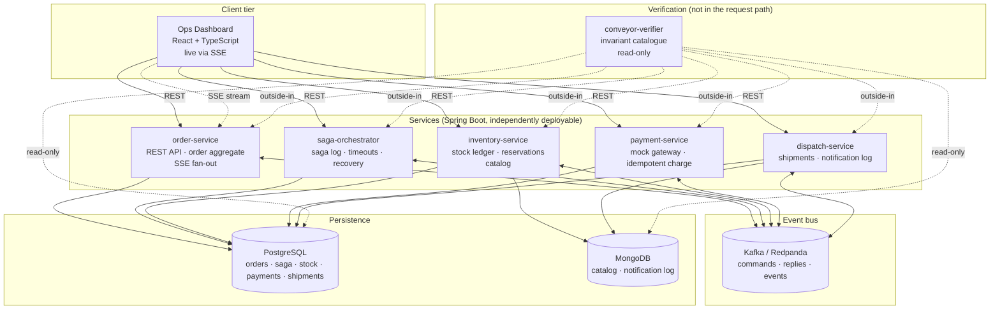

# Conveyor

A cloud-native, event-driven order fulfillment platform — Saga-pattern distributed transactions
over Kafka, polyglot persistence (PostgreSQL + MongoDB), a real-time ops dashboard, and a genuine
chaos/load/autoscaling rigor pass, all measured rather than asserted. The service-layer counterpart
to [Anvil](../Anvil)'s storage-engine-level two-phase commit.

> **Status: all 16 phases complete.** `docker compose up` gives a live, five-service order pipeline
> with a real-time dashboard; `./mvnw verify` is green across the full 9-module reactor; the rigor
> stage (Stage D) has real, measured numbers in [`RESULTS.md`](RESULTS.md); CI/CD deploys to a fresh
> kind cluster on every push. See [`CONTEXT.md`](CONTEXT.md) for the phase-by-phase record.

## What this is

A customer places an order. The system reserves inventory, charges payment, and confirms the order
— or, if any step fails, correctly and observably **compensates** (releases inventory, refunds
payment) so the system never ends up inconsistent. The whole pipeline is visible live on an
operations dashboard: place an order in one tab, watch it move across the board in another.

- **Backend:** five independently deployable Spring Boot services — order, inventory, payment,
  dispatch, and a dedicated saga orchestrator — talking over Kafka, plus a sixth deployable
  (`conveyor-verifier`) that continuously checks correctness invariants and is never in a request
  path.
- **Data:** PostgreSQL for transactional state, MongoDB for document-shaped data, split
  deliberately by data shape, not by résumé coverage (`docs/adr/0012`).
- **Frontend:** a React 19 + TypeScript ops dashboard, live via Server-Sent Events, no polling.
- **Rigor:** an invariant checker with negative controls, a 69-trial chaos matrix, a load test that
  found and named a real bottleneck, and an autoscaling measurement — each phase found and fixed
  real bugs no code review would have (ten of them; see [`RESULTS.md`](RESULTS.md)'s "at a glance").
- **CI/CD:** every push builds, tests, containerizes, pushes to GHCR, deploys to a fresh kind
  cluster, smoke-tests it, and gates on the invariant checker — at $0, by construction
  (`docs/adr/0013`).

## The throughline: Saga is the service-layer analogue of 2PC

Two-phase commit gets atomicity by holding locks across a *prepare* phase until a coordinator
decides — affordable inside one database, not affordable across services owned by different teams
scaling independently. Conveyor's saga trades atomicity for a weaker, achievable guarantee instead:

> **Saga guarantee.** The system reaches one of two terminal outcomes for every order: *all*
> forward steps applied, or *every applied forward step compensated*. Intermediate states are
> observable — there is no isolation — but no terminal state leaves the system inconsistent.

| Property | 2PC | Saga (this project) |
|---|---|---|
| Atomicity | Real — nobody observes a partial commit | **No** — inventory is visibly reserved before payment is charged |
| Isolation | Serializable | **None between steps** — handled with semantic locks (reservations) instead |
| Coordinator crash | Participants block until recovery | Participants never block; the saga log drives recovery |
| Rollback | Physical — undo the write | **Semantic** — a compensating action (`release`, `refund`), itself a new forward transaction |
| "Is it actually correct?" proof | An Elle-style checker over client histories | An invariant checker over five service databases + a 69-trial chaos matrix |

Full reasoning: `ARCHITECTURE.md` §1. The rigor phases (Stage D) exist to make the bottom row
*measured*, not claimed — see [`RESULTS.md`](RESULTS.md).

## Architecture



Full design (service boundaries, data model, event schemas, all 13 ADRs, sequence diagrams for the
happy path and every compensation path): [`ARCHITECTURE.md`](ARCHITECTURE.md).

## Running it locally

Requires: Docker, Docker Compose. Maven is **not** required — the repo uses the Maven Wrapper
(`./mvnw`); GNU Make is optional — every `make` target is a thin wrapper over one or two
`docker compose`/`./mvnw` commands, shown directly below in case `make` isn't installed.

```bash
cp .env.example .env
docker compose up -d --build      # or: make up
docker compose ps                 # or: make ps — wait for all 8 containers "healthy"
```

Seed demo data (idempotent — safe to run again):

```bash
docker compose run --rm -e SPRING_PROFILES_ACTIVE=seed order-service
docker compose run --rm -e SPRING_PROFILES_ACTIVE=seed inventory-service
# or: make seed
```

Place an order:

```bash
curl -X POST http://localhost:8081/api/v1/orders \
  -H "Content-Type: application/json" \
  -d '{
        "customerId": "9b2ecb1a-0000-4000-8000-000000000003",
        "items": [{ "sku": "SKU-0001", "quantity": 2, "unitPrice": 9.99 }],
        "shippingAddress": { "line1": "1 Test St", "city": "Testville", "postalCode": "00000", "country": "IN" },
        "currency": "USD",
        "paymentMethodToken": "tok_test_visa"
      }'
# 202 Accepted, {"orderId": "...", "sagaId": null, "status": "PLACED"}

curl http://localhost:8081/api/v1/orders/<orderId>   # watch it move to CONFIRMED within a few seconds
```

Or watch the whole thing live: run the frontend (`cd frontend && npm install && npm run dev`, or use
the deployed dashboard — see Deployment below), log in as `admin`/`admin_local_dev_only`, and place
an order from the UI. The kanban board moves the order card across columns in real time as the saga
progresses.

Each service publishes an OpenAPI spec at `/v3/api-docs` and a browsable UI at `/swagger-ui.html`
(e.g. http://localhost:8081/swagger-ui.html). Health endpoints:

| Service | Port | Health |
|---|---|---|
| order-service | 8081 | http://localhost:8081/actuator/health |
| inventory-service | 8082 | http://localhost:8082/actuator/health |
| payment-service | 8083 | http://localhost:8083/actuator/health |
| saga-orchestrator | 8084 | http://localhost:8084/actuator/health |
| dispatch-service | 8085 | http://localhost:8085/actuator/health |

**On Kubernetes instead of Compose:** `./scripts/kind-up.sh` (or `make kind-up`) brings up a 3-node
kind cluster (Calico, Strimzi Kafka, metrics-server) and `helm install`s the same five services —
see `PLAN.md` Phase 13.

## Building and testing

```bash
./mvnw verify        # compile, unit + integration tests (Testcontainers), Spotless, Checkstyle
./mvnw -pl e2e verify -DskipE2E=false   # whole-stack E2E via a real Compose network
```

Integration tests spin up real PostgreSQL, MongoDB, and Redpanda via Testcontainers — Docker must
be running. 186+ tests across 9 modules, zero mocks in the paths that matter (`docs/INTERVIEW.md`
question 20 has the reasoning).

## Observability

```bash
docker compose --profile observability up -d prometheus tempo grafana   # or: make observability-up
```

Every service always emits metrics (`/actuator/prometheus`) and traces (OTLP), regardless of
whether this profile is running. Grafana (`localhost:3000`, anonymous admin) auto-provisions three
dashboards (Saga Health, Pipeline Latency, Infrastructure). Config: `infra/observability/`;
`ARCHITECTURE.md` §11.

## Rigor: measured, not asserted

| Rigor phase | Headline result |
|---|---|
| Invariant checker (Phase 10) | 15/15 invariants soundness-proven via negative controls; 500/500 clean states, zero false positives |
| Chaos matrix (Phase 11) | 69 trials, 7 injection points; **true verified compensation-correctness: 60/60 (100%)** among fairly-timed trials; 2 real bugs found and fixed |
| Load test (Phase 12) | Knee at **120 VUs / ~45.8 orders/s**; bottleneck named and trace-evidenced; 30-min soak, 66,457 orders, zero invariant violations |
| Autoscaling (Phase 15) | Both a CPU-HPA and a custom-metric HPA proven live on a real multi-node kind cluster; scale-up latency decomposed; 1 more real bug found and fixed |

Full numbers, every one with its measurement conditions: [`RESULTS.md`](RESULTS.md). **Ten real
bugs were found by these four phases alone**, none of which a green `./mvnw verify` would have
surfaced — the actual argument for running them (`BUGS.md` has full root-cause detail on every one).

## What each part of the stack demonstrates

| Component | Claim it substantiates |
|---|---|
| `saga-orchestrator` + saga log | Distributed transactions at the service layer; the 2PC↔Saga comparison from both sides |
| Transactional outbox | "Commit then publish" is not atomic — the same class of bug as Anvil's ack-before-fsync |
| Inbox + business idempotency | Exactly-once *effects* over at-least-once delivery, and why the distinction matters |
| Guarded conditional UPDATE + check constraint | Concurrency control under contention without check-then-act |
| Pivot transaction / compensatable vs. retriable steps | Saga theory applied, not just "publish some events" |
| Step timeouts + `SKIP LOCKED` sweep | Liveness under message loss; recovery as the same code path as normal operation |
| Invariant catalogue + negative controls | Correctness as a measured property |
| Chaos matrix with named injection points | A percentage, not an anecdote |
| SSE fan-out with per-replica consumer groups | Real-time UX under horizontal scaling |
| Polyglot persistence inside one bounded context | Choosing a datastore by data shape, not by résumé coverage |
| Trace propagation through Kafka headers | One order = one trace across five services |
| Two real, different HPAs on a real multi-node cluster | Autoscaling as a measured control loop, decomposed, not a slide |
| Terraform written/validated, never applied | Cost discipline as an engineering property, proven in CI on every push |

Full table: `ARCHITECTURE.md` Appendix A.

## Deployment

Zero cloud cost, by design (`docs/adr/0013`): every push builds all six images, pushes to GHCR,
spins up a fresh kind cluster inside the GitHub Actions runner, deploys via Helm, smoke-tests it,
and gates on the invariant checker — then tears the cluster down, regardless of outcome. The
frontend deploys to GitHub Pages, live at **https://tejas544.github.io/Conveyor/**. A fully costed
AWS path (real EKS/RDS/ECR) is written as Terraform and `plan`-validated on every push, but
`terraform apply` has never run — verified by grep in CI, not merely asserted. Full detail:
[`docs/DEPLOYMENT.md`](docs/DEPLOYMENT.md).

## Documentation map

| File | Purpose |
|---|---|
| [`PROJECT_BRIEF.md`](PROJECT_BRIEF.md) | Frozen requirements |
| [`ARCHITECTURE.md`](ARCHITECTURE.md) | Design, all 13 ADRs, data model, event schemas, sequence diagrams, invariant catalogue |
| [`PLAN.md`](PLAN.md) | Phase-by-phase build plan, all 16 phases, all exit criteria checked |
| [`CONTEXT.md`](CONTEXT.md) | Live state through every phase — the fastest way to see how the project actually unfolded |
| [`BUGS.md`](BUGS.md) | Append-only bug ledger — every bug found, root-caused, and its final status |
| [`RESULTS.md`](RESULTS.md) | Chaos/load/autoscaling numbers, every one with its measurement conditions |
| [`docs/DEPLOYMENT.md`](docs/DEPLOYMENT.md) | The executed $0 path and the costed AWS fallback |
| [`docs/DEMO.md`](docs/DEMO.md) | The ~3-minute walkthrough script |
| [`docs/INTERVIEW.md`](docs/INTERVIEW.md) | Twenty hard questions this project answers with specifics, not generalities |
| [`docs/LIMITATIONS.md`](docs/LIMITATIONS.md) | What this system does not do, and what would break in production — written honestly |
| [`docs/INVARIANTS.md`](docs/INVARIANTS.md) | The 15-invariant catalogue `conveyor-verifier` checks |
| [`docs/adr/`](docs/adr/) | One-page-each ADR summaries, reconciled against what was actually built |
