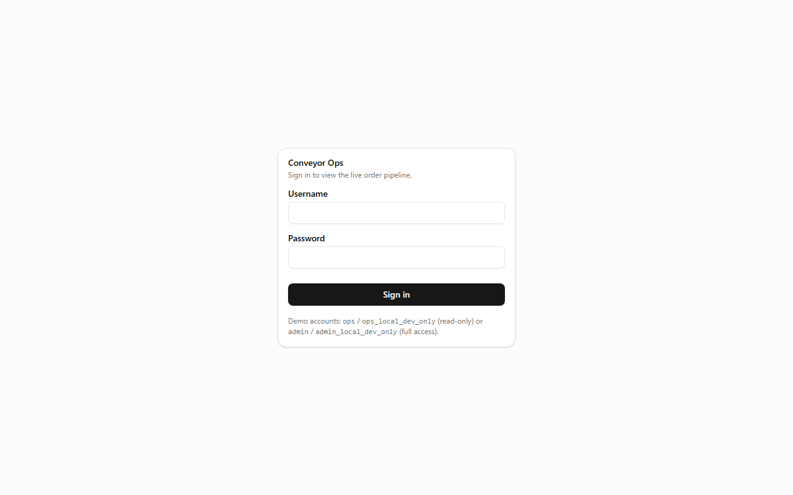
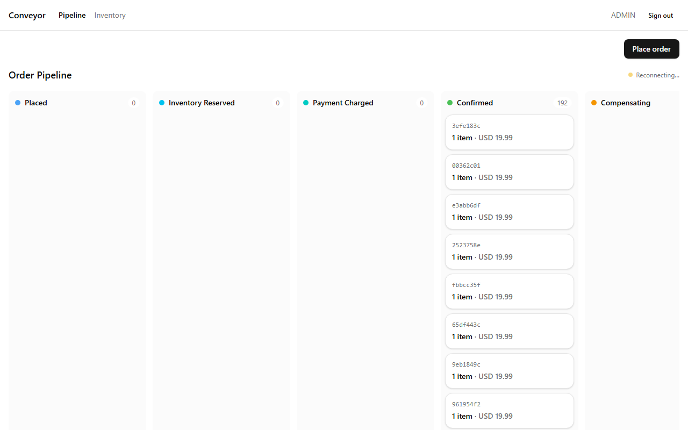
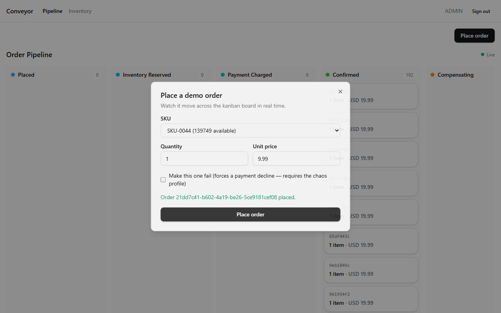
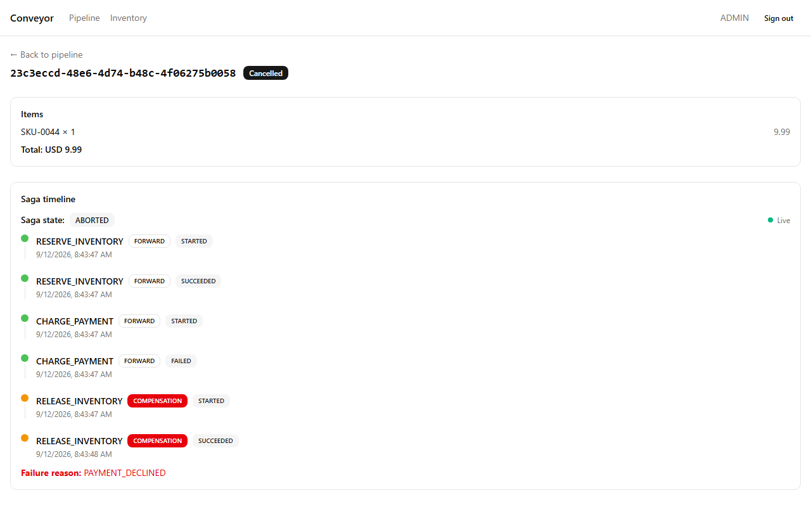
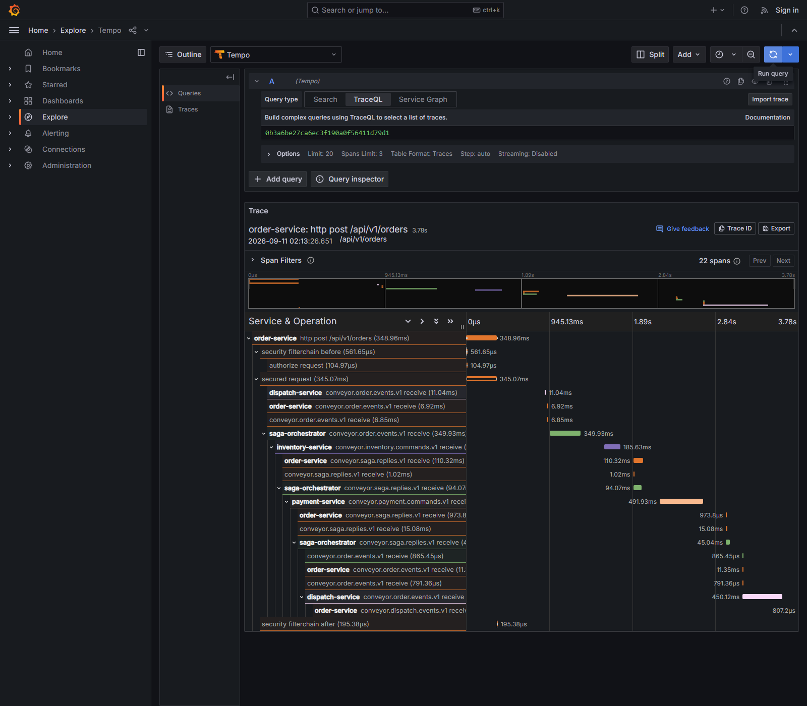

# Demo walkthrough (~3 minutes)

A script for showing this project live, in order: place an order, watch it flow, force a payment
failure, watch compensation, kill the orchestrator mid-saga, watch recovery, show the trace, show
the invariant checker. Every screenshot below is a real capture against a live local stack
(`docker compose up`, `npm run dev`), not a mockup — `scripts/capture-demo-screenshots.mjs`
reproduces steps 1-4 exactly (`node scripts/capture-demo-screenshots.mjs <outputDir>`, run from
`frontend/` with the dev server and a seeded stack already up).

**On recording a video:** this session captured every step as a real, live screenshot (below) but
did not produce an actual screen-recording file — this environment has no video-capture tool
available, only the browser automation used to drive and screenshot the live app. Anyone narrating
this script in front of a screen recorder gets the same live behavior these screenshots show; the
script itself is written so it can be read aloud over a live session exactly as staged.

---

## 1. Login and the live pipeline board

Open the dashboard (locally: `cd frontend && npm run dev`, then http://localhost:5173; or the
deployed dashboard at https://tejas544.github.io/Conveyor/), sign in as `admin` /
`admin_local_dev_only`.



The kanban board renders live, connected via SSE (`Live` indicator, top right) — every column is a
real order status (`Placed` → `Inventory Reserved` → `Payment Charged` → `Confirmed`, plus
`Compensating`/`Cancelled`), not a static mock.



## 2. Place an order, watch it flow

Click **Place order**, accept the defaults, submit. The card appears in `Placed` and — for a
correctly-provisioned order — moves across every column to `Confirmed` in real time, no page
reload, no polling: each column change is pushed over the same SSE stream the moment
`saga-orchestrator` advances the saga and `order-service` projects the new status.



## 3. Force a payment failure, watch compensation

Click **Place order** again, this time checking **"Make this one fail"** (calls
`payment-service`'s chaos-profile-only `POST /test/failure-mode` before placing the order — see
ADR-5/`docs/INTERVIEW.md` question 10 for why this exists only under the `chaos` profile). Open the
resulting order's detail page and watch the saga timeline render live:



Read the timeline top to bottom: `RESERVE_INVENTORY` succeeds, `CHARGE_PAYMENT` fails
(`PAYMENT_DECLINED`), then — the actual point of the whole exercise — `RELEASE_INVENTORY`
(labeled `COMPENSATION`, visually distinct in red) starts and succeeds. The order's own header
badge and the saga's own state (`ABORTED`) agree with each other and with the timeline below,
live, not just on a fresh page load (`BUG-0052` — found and fixed capturing this exact screenshot;
see `BUGS.md`).

## 4. Kill the orchestrator mid-saga, watch recovery

```bash
# Place a few orders back to back, then kill the orchestrator immediately:
curl -X POST http://localhost:8081/api/v1/orders -H "Content-Type: application/json" -d '{...}'
docker stop conveyor-saga-orchestrator-1

# Check status while it's down -- genuinely stuck mid-flight, not silently lost:
curl http://localhost:8081/api/v1/orders/<orderId>   # e.g. "PLACED" or "INVENTORY_RESERVED"

# Bring it back:
docker start conveyor-saga-orchestrator-1
# within ~15-30s (JVM boot + catching up on the backlog it missed while down):
curl http://localhost:8081/api/v1/orders/<orderId>   # reaches a real terminal state
```

Verified live this session: three orders placed immediately before stopping
`saga-orchestrator` were genuinely stuck (`PLACED`/`INVENTORY_RESERVED`) for the whole outage: one
order's own saga step log shows `RESERVE_INVENTORY STARTED` at the instant of the kill and
`RESERVE_INVENTORY SUCCEEDED` **30 seconds later** — the exact moment the restarted orchestrator
caught up on the Kafka reply it missed while it was down — continuing the saga from exactly where
it left off rather than losing or duplicating anything. Recovery is the *same code path* as normal
timeout handling (`ARCHITECTURE.md` §7.4, `docs/INTERVIEW.md` question 8), not a special case: the
sweeper (or, here, simple redelivery once the consumer group rejoined) is what "recovery" actually
is in this system.

## 5. Show the trace

```bash
docker compose --profile observability up -d prometheus tempo grafana   # or: make observability-up
```

Grafana at `localhost:3000` (anonymous admin) → Explore → Tempo → search by the `traceId` from any
service's own JSON log line (every log line during an order carries it). One order = one trace
across all five services. A real, previously-captured example from this exact pipeline (Phase 9,
68 spans, order-service → saga-orchestrator → inventory-service → payment-service →
dispatch-service, 3.78s):



*(This session's own attempt to bring the observability profile up hit a host-specific Windows
port-exclusion issue on port 3200 unrelated to Conveyor's own code — the same class of local
environment quirk logged elsewhere in `BUGS.md`/`CONTEXT.md` for this machine. The mechanism above
is unchanged and already proven live in Phase 9; it just wasn't re-captured fresh this session.)*

## 6. Show the invariant checker

```bash
docker compose run --rm -e SPRING_PROFILES_ACTIVE=oneshot conveyor-verifier   # or: make invariant-check
```

```
conveyor-verifier clean run: 15 invariants checked, 0 violations
conveyor-verifier one-shot run complete: 15 invariants, 0 inside-out violation(s) — exit 0
```

Verified live this session, immediately after the forced-failure and crash-recovery steps above —
the checker runs against whatever state those steps actually left behind, not a pristine
pre-arranged database. Exit code 0 is what `build.yml`'s CI gate and `infra/k8s/*-cronjob.yaml`'s
Kubernetes deployment gate both key off.

---

**What this walkthrough proves, end to end:** a real order moves through five independently
deployable services via Kafka; a real failure correctly and visibly compensates; a real process
crash mid-saga does not lose or duplicate anything; and an independent, read-only checker confirms
correctness after all of it — the whole argument this project exists to make, shown live rather
than only asserted in `RESULTS.md`.
